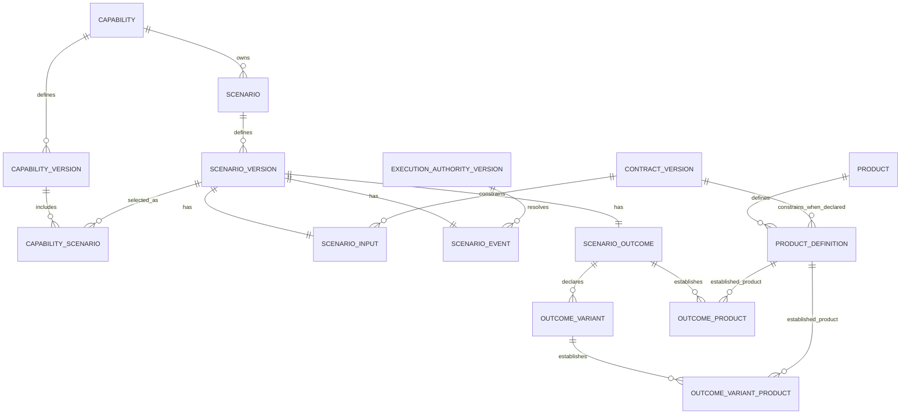
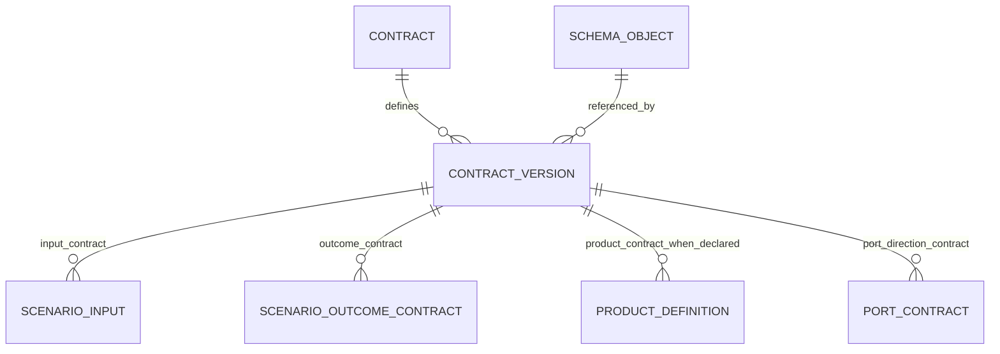
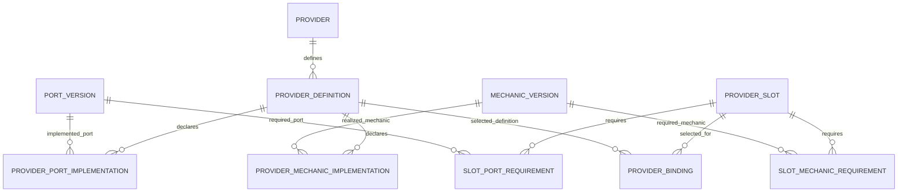

# SideFX Database data architecture strategy

**Status:** Semantic architecture frozen. On 7 September 2026, the user authorized migration after confirming the database was empty. The implementation scope and executed checks are recorded in [migration-001.md](C:/lab/sidefx-database/docs/migration-001.md). Remaining source-profile mapping work does not reopen the ontology.

**Scope:** Normalize the observed SideFX estate for inspection, joins, impact analysis, and circuit diagnostics. The semantic model is the primary SQL experience. Database mutation, runtime control, and a receipt-management system are outside the initial rebuild.

**Implementation boundary:** The earlier database and unfinished local repair code are not the reference architecture. The design-review statements below describe the baseline; current migration status is recorded separately. The companion [Physical SQL Server specification](C:/lab/sidefx-database/docs/physical-data-model-review.md) specifies tables, source mappings, enforceable constraints, query contracts, and negative integrity tests. Review it before implementation; prove the physical constraints before loading. The agreed implementation approach remains a clean rebuild of the incorrect derived tables, not an in-place repair of their rows or preservation of the bad extraction generations.

## 1. Decisions that govern the model

1. **Model the SideFX ontology first.** A document appearance is not an entity. A JSON property is not sufficient evidence of an entity's kind or ownership.
2. **Separate stable identity, exact definition, and use.** One provider used by forty capabilities is one provider identity, its referenced definitions, and forty uses. The same rule applies to contracts and mechanics.
3. **Make relationships explicit.** Ownership, establishment, satisfaction, implementation, selection, and structural realization are different relationships with different keys and constraints.
4. **Keep scenario faces scenario-owned.** A scenario has exactly one Input, one Event, and one Outcome. They are not a globally reusable collection of loosely matching labels.
5. **Keep Outcome and Product distinct.** An Outcome states what became true. A Product or observable state states what became available for downstream composition.
6. **Use one contract definition system.** Inputs, outcome payloads where declared, products, and port directions reference contract versions. There is no parallel InputSchema, OutcomeSchema, ProductSchema, or PortSchema system.
7. **Separate provider capability from provider selection.** A declaration that a provider can implement a port or mechanic does not establish that it is selected, qualified, admitted, or ready to execute in a particular context.
8. **Blueprints reference meaning and own topology.** Blueprint nodes do not become additional copies of Scenario, Event, Outcome, Product, or Mechanic definitions.
9. **Enforce entity integrity while preserving bad source observations.** No null entity keys, duplicate natural keys, fabricated target rows, or dangling foreign keys. An invalid source declaration remains queryable with its unresolved references and findings.
10. **Keep evidence subordinate and out of the default semantic surface.** Receipts and run logs do not become capability, provider, event, or outcome rows.
11. **Bind analysis to an exact estate and rule set.** Structural consistency, source admission, contract compatibility, proof sufficiency, and runtime readiness are separate claims.
12. **Do not let SQL decide the unresolved topology projection law.** Blueprint edges, semantic-graph transitions, and declared execution invocations remain distinguishable.

The authority direction is described in [ADR-001, authority precedence](C:/lab/repos/agentic-harness/docs/adr-001-design-identity-capability-capsules.md:173). The inspection model must preserve it; being convenient to query does not make SQL a new semantic authority.

## 2. Review of the supplied notes and earlier proposals

The ontology note provides the relational foundation. The monotonic-circuit note supplies the questions the model must eventually answer. Several details need qualification before becoming database constraints.

| Proposal or earlier assumption | Decision for this strategy |
|---|---|
| Reusable global Input/Event/Outcome rows linked from each scenario | Superseded. Scenario faces are owned by the scenario and defined within its exact version. Shared contracts, execution authorities, products, and provider implementations are referenced separately. Equal labels do not establish shared face identity. |
| One Outcome points to one Product | Use `outcome_product` for unconditional establishment and `outcome_variant_product` for variant-conditioned establishment. Both reference exact first-class Product definitions. A profile declaring one product contributes one link. |
| Every Outcome must always establish at least one Product | Apply the minimum cardinality from the source profile. ADR-001 requires a product or observable state where downstream composition is required; a terminal-only result is not automatically defective for lacking a data product. |
| Every Outcome carries its own required contract FK | Only where an outcome contract is actually declared. The inspected carrier v2/v3 shape declares a product contract, not a separate outcome contract. Use a separate outcome-contract relationship where applicable rather than copying the product contract into an invented outcome obligation. |
| `UNIQUE(schema_object_digest)` on `contract_version` | Reject that placement. It would prevent two different contracts from referencing the same schema bytes. Deduplicate the schema object once and permit multiple contract-version references. Same shape is not necessarily same meaning. |
| `UNIQUE(authority_digest)` on every version table | Use `UNIQUE(identity_pk, definition_digest)`, where the digest identifies the canonical semantic definition or canonical definition manifest. Raw document, capsule, and referenced-authority digests remain separate. |
| Require a version label for every source | Do not fabricate labels or strip `.v1` suffixes to invent stable identities. Exact definition identity is required; a declared version label is recorded only when the source supplies it or an explicit mapping law establishes it. |
| Every provider slot requires a port | Not universal. Observed v3 runtime slots can declare a mechanic and profile constraints without a port ID. Model typed requirements; do not manufacture a port to fill a column. |
| A generic semantic identity spine | Keep `semantic_object` and `semantic_object_definition` as an address registry with one-to-one concrete bindings. Prove kind, owner, and definition integrity in SQL Server; use typed references if the registry cannot meet that standard. |
| `product_definition` without an explicit identity owner | Superseded by the semantic freeze. Product has durable first-class identity: `product -> product_definition`. An Outcome establishes it; an Outcome does not own its reusable identity. |
| Reject the whole import when the estate has a semantic defect | Reject defective normalized rows or unresolved relationship promotion, preserve the source, and publish explicit findings and coverage. Reject the whole import for infrastructure corruption, mixed generations, or an importer integrity failure. |
| Contract-ID equality proves satisfaction; inequality disproves it | Neither is sufficient generally. Satisfaction is an explicit governed relationship, and compatibility depends on exact versions and applicable compatibility authority. |
| A declared `NARROWS` edge proves monotonic behavior | It proves that narrowing was declared. Grammar validation and behavioral proof are different checks. |
| No observed traversal of a designed edge proves execution failure | Only after comparing a version-pinned run with the routes expected for its admitted variants and inputs. An unselected branch is not a missing execution. |
| SQL can report a provider cell energized from static rows | Deferred. Static SQL can report declared requirements, implementations, selections, and gaps. Qualification and runtime readiness have explicit scope/status; implementation plus binding never implies eligibility. |

The initial review approved the conceptual boundaries and held DDL. The latest semantic freeze settles the previously conditional Product, namespace, and definition-identity choices. Source-to-column mappings and database-enforcement proofs remain physical review work; they must not reopen those semantic decisions.

## 3. SQL surfaces and responsibilities

The design separates storage responsibilities without requiring users to navigate import machinery for ordinary questions.

| Surface | Responsibility | Typical contents |
|---|---|---|
| `model` | Typed identities, definitions, and resolved relationships | Capability, scenario faces, products, contracts, operations, mechanics, providers, bindings, blueprint geometry |
| `sidefx` | Convenient views over the selected estate | One row per current capability or other declared view grain; explicit views for versions, uses, and circuit cells |
| `source` | Supporting source traceability and unresolved declarations | Estate snapshot, content objects, source appearances, classification, declaration observations, lineage |
| `analysis` | Derived assessments with scope and coverage | Integrity findings, unresolved references, circuit diagnostics; compatibility assessments only where supported by an explicit authority/rule mapping |
| Runtime/evidence extension | Deferred, opt-in observation of executions and qualification evidence | Version-pinned runs, observed traversal, product arrival, proof currency; no semantic redefinition |

Schemas are organizational boundaries, not additional ontologies. Existing schema names may be retired during the clean rebuild after the physical specification is reviewed.

The default query surface excludes ingestion receipts, proof execution logs, conformance receipts, arbitrary document payloads, and copied runtime plans. Those records may be retained as source material when needed for traceability. They do not receive first-class semantic tables merely because the original import found them.

Fixture and observable-condition **definitions** are different: they describe declared architectural obligations and may be part of the proof-definition family. Their execution results remain separate.

## 4. Identity, definition, membership, and use

### 4.1 Four different row grains

| Grain | Example | Meaning of another row |
|---|---|---|
| Identity | `provider` | Another provider |
| Definition | `provider_definition` | Another exact definition of that provider |
| Estate membership | Selected capability version for one snapshot | A particular definition is present in that estate |
| Use | Provider binding for a slot and context | Another declared use of a provider definition |

Entity counts must come from identity rows. Definition, membership, source-copy, and binding counts must be labeled as such. Re-running an importer must not increase the number of providers or capabilities.

### 4.2 Key rules

- Every primary key and every component of a natural identity key is non-null.
- Mechanical surrogate keys support joins. They are not source-declared SideFX IDs and are never presented as such.
- Each identity has a unique declared identifier within its **documented authority namespace and ownership scope**. Global identity is used only where the source contract establishes it.
- A scenario has `UNIQUE(capability_pk, scenario_id)`. A face is owned by its scenario; identical face labels in different scenarios do not make those faces one object.
- Mechanics and providers are shared identities in their governed namespaces. Names from an external HTTP catalog, platform capability IDs, mechanic IDs, and provider-profile IDs are not interchangeable namespaces.
- Case handling, identifier length, and version normalization are explicit per-family mapping decisions. Do not deduplicate by case-insensitive display name or truncate identifiers to fit a key.
- No identity is minted from a filename, an array position, a missing tag, or an inferred capability owner. Array ordinals may be genuine relational keys for anonymous ordered children; they must not be mislabeled as declared operation or assertion IDs.

**The namespace pattern is frozen.** `identity_namespace(namespace_pk, namespace_kind, namespace_id)` has `UNIQUE(namespace_kind, namespace_id)`. Every reusable identity has a required namespace FK and `UNIQUE(namespace_pk, declared_id)`, with the family-specific ID column name. Scenario remains capability-owned with `UNIQUE(capability_pk, scenario_id)`. Physical source mappings bind each authority profile to an explicit namespace and preserve declared IDs verbatim, including `.v1` suffixes. They specify case/collation and length without guessing, filename identity, or display-name deduplication. Missing namespace resolution is a mapping finding, not a reason to reopen shared identity or create a guessed namespace.

### 4.3 Definitions and versions

Reusable or independently governed nouns separate identity from exact definition: Capability, Scenario, Product, Contract, Execution Authority, Transformation, Mechanic, Port, Provider, Provider Profile, and Blueprint. The physical names are `capability/capability_version`, `scenario/scenario_version`, `product/product_definition`, `contract/contract_version`, `execution_authority/execution_authority_version`, `transformation/transformation_version`, `mechanic/mechanic_version`, `port/port_version`, `provider/provider_definition`, `provider_profile/provider_profile_version`, and `blueprint/blueprint_version`. Other children are versioned through their owning definition unless authority declares an independent revision boundary.

**Definition identity is frozen as content-addressed.** Every independently governed definition has `definition_digest`, with `UNIQUE(identity_pk, definition_digest)`. The digest identifies its exact canonical semantic definition. When several authorities contribute, digest the canonical definition manifest/source set, with explicit roles, ordering, and source boundaries. The physical mapping specifies the canonicalization contract; it does not choose between unrelated digest meanings.

`raw_document_digest`, `capsule_digest`, and `referenced_authority_digest` retain their distinct meanings. None substitutes for `definition_digest` merely because all begin with `sha256:`. Version labels are aliases over exact definition digests; they do not create identities. A source lacking an independently resolvable definition remains an observation with a mapping finding.

A declared version label maps to one definition within its identity. If a source declares the same label for two different definitions, retain both observations and record `VERSION_DEFINITION_CONFLICT`; do not select either by arrival time. An absent label is not a fabricated `1.0.0`, `latest`, or null semantic ID. Version-label uniqueness applies to declared labels, using an appropriate filtered constraint or a separate label relation.

The selected estate has explicit membership relations, including one selected capsule-backed capability version per capability identity. Definitions referenced by that estate may include different versions of a shared provider or contract. Current views must not choose a version using `MAX(version)`, filesystem order, or the most recent import timestamp.

### 4.4 Same identity is not the same as same bytes

Two source appearances with the same identity and definition contribute lineage to one normalized definition. Two distinct identities with the same schema bytes share the stored schema object but remain distinct contracts. This is an architectural duplication *candidate*, not permission to merge them.

Two sources disagreeing about the same selected semantic fact produce a conflict. No arbitrary representative, `DISTINCT`, or null-filled merged row may be used to make the disagreement disappear.

## 5. Scenario and semantic backplane

The relational spine follows [ADR-001, Semantic Backplane Law](C:/lab/repos/agentic-harness/docs/adr-001-design-identity-capability-capsules.md:2339):

```text
Capability -> Scenario -> Outcome
                           |
                           +-- ESTABLISHES --> Product / observable state
                                                |
                                                +-- SATISFIES --> downstream Input
                                                                    |
                                                                    +--> Scenario -> Capability
```

### 5.1 Scenario-owned faces



The diagram describes a **complete normalized scenario definition**. An incomplete source observation is retained outside that complete surface. The event-to-execution-authority relationship is resolved for profiles that declare it; an absent or unresolved declaration is visible as a gap, not filled with an invented authority.

Product identity is independently reusable. Unconditional and variant-conditioned establishment are separate relationships, each referencing an exact Product definition.

| Relation | Key and cardinality | Responsibility |
|---|---|---|
| `scenario` | PK `scenario_pk`; unique `(capability_pk, scenario_id)` | Stable scenario identity and ownership |
| `scenario_version` | PK `scenario_version_pk`; unique `(scenario_pk, definition_digest)` | Exact scenario meaning, name, source-profile identity |
| `capability_scenario` | Unique `(capability_version_pk, scenario_pk)`; composite FKs bind capability ownership and the matching scenario version | Exact scenario membership; cannot include a different capability's scenario |
| `scenario_input` | PK/FK `scenario_version_pk` | Declared input ID and meaning, exact input contract reference |
| `scenario_event` | PK/FK `scenario_version_pk` | Declared event ID, meaningful responsibility, resolved execution-authority reference where required |
| `scenario_outcome` | PK/FK `scenario_version_pk` | Declared outcome ID, established experience/state, applicable terminality |
| `outcome_variant` | PK `outcome_variant_pk`; unique `(scenario_version_pk, variant_id)` | Decisional alternatives belonging to this exact outcome |
| `outcome_product` | PK `(scenario_version_pk, product_definition_pk)` | Unconditional establishment by this exact outcome |
| `outcome_variant_product` | PK `(outcome_variant_pk, product_definition_pk)` | Establishment by this exact outcome variant; no nullable variant key |

Shared-primary-key faces enforce **at most one** of each face. They do not, by themselves, enforce **at least one**. A required completeness check establishes all three before a scenario is exposed through the complete-scenario view. SQL Server does not acquire a deferred mandatory-child constraint simply because the ERD draws a one-to-one line.

No separate `Behavior`, `ScenarioBehavior`, global reusable ScenarioInput, or duplicate Gherkin/DATA-ACTION-EXPERIENCE ontology is introduced. The three label lenses describe the same scenario faces. Lower-altitude execution and provider results do not become additional ScenarioOutcomes.

#### Required ownership enforcement

The database must enforce both invariants for every `capability_scenario` membership:

```text
scenario.capability_pk = capability_version.capability_pk
scenario_version.scenario_pk = capability_scenario.scenario_pk
```

One candidate relational design carries non-null `capability_pk`, `capability_version_pk`, `scenario_pk`, and `scenario_version_pk` on the membership, with these parent candidate keys and composite FKs:

| Parent candidate key | Membership FK | Invariant enforced |
|---|---|---|
| `capability_version(capability_pk, capability_version_pk)` | `(capability_pk, capability_version_pk)` | The selected capability version belongs to this capability |
| `scenario(capability_pk, scenario_pk)` | `(capability_pk, scenario_pk)` | The scenario belongs to that same capability |
| `scenario_version(scenario_pk, scenario_version_pk)` | `(scenario_pk, scenario_version_pk)` | The selected scenario version belongs to that same scenario |

Together with `UNIQUE(capability_version_pk, scenario_pk)`, these constraints prevent both cross-capability membership and substitution of another scenario's version. The physical review may choose an equivalent database-enforced design. Separate valid FKs to unrelated rows, or an importer check, do not establish these invariants.

Apply this rule throughout the model whenever a relationship carries both identity and definition, or both owner and child. Examples include selected provider/implementation pairs, blueprint/node endpoints, and outcome/variant selections. Negative SQL tests must attempt mismatched inserts and updates directly, bypassing the importer, and show that the database rejects them.

### 5.2 First-class Product identity and contracts

**Product identity is settled.** `product(product_pk, namespace_pk, product_id)` has `UNIQUE(namespace_pk, product_id)`. `product_definition` has a required Product FK, `definition_digest`, an optional declared version alias, an exact contract FK where declared, and its one-to-one semantic-definition address. It has `UNIQUE(product_pk, definition_digest)`.

An Outcome establishes a Product through `outcome_product`; an OutcomeVariant establishes it through `outcome_variant_product`. These relations use the composite primary keys in section 5.1. Multiple capabilities can establish or consume the same exact Product definition. Equal names or equal contract shapes do not establish Product identity.

The inspected carrier `product.id`, `product.name`, and `product.contractRef` map into this frozen model. Source-profile differences affect extraction, namespace resolution, and definition canonicalization. They do not turn Product into an incidental payload or a scenario-owned identity.

Product minimum cardinality is profile-specific. The inspected carrier v2/v3 schema supplies a singular product and therefore maps to one relationship. The wider model supports additional declared products. It does not assume that every terminal or physical result requires a product.

Inputs and Product definitions reference exact contract versions where declared by their profiles. Where an outcome additionally declares an outcome contract, `scenario_outcome_contract` records that relationship. Never synthesize an outcome contract merely because a product has one.

### 5.3 Product-to-input satisfaction

Product-to-input satisfaction is many-to-many **through explicit, version-pinned circuit relationships**. It is not inferred by joining equal contract names.

For a blueprint contract edge, a typed `blueprint_edge_contract` extension binds:

- The parent edge and its declared `SATISFIES` or `REQUIRES` relation.
- The exact Product definition.
- The exact downstream scenario-input definition.
- The governing binding/compatibility authority reference where declared.

This relation normalizes part of the blueprint edge; it is not a second independently authored graph. `v_product_input_satisfaction` presents these relationships and their compatibility assessment. A satisfaction declaration, a compatible schema relationship, and an observed runtime product arrival remain different facts.

## 6. One contract system



`contract` owns declared contract identity. `contract_version` binds its exact definition and source-declared version label where present. `schema_object` is a deduplicated schema-content reference with dialect metadata; the content store holds the bytes once. It is not another contract system.

The Product contract FK belongs on `product_definition`, preserving independent Product and Contract identity.

One schema object may support multiple contract identities or versions. Uniqueness of the stored content digest belongs to the content/schema object, not to every referring contract-version row. Source path and containment also belong to source appearances; identical schema bytes at two paths do not become two schema identities.

`port_contract` records direction and any declared role/ordinal. It supports the actual port profile, rather than assuming every port has one request and one response when a profile declares something else.

Compatibility assessments bind producer and consumer contract versions and the applied rule/authority. Their outcomes distinguish `COMPATIBLE`, `INCOMPATIBLE`, and `NOT_EVALUATED`. Equal IDs do not prove compatible versions; unequal IDs do not prove incompatibility. SQL string comparison is not a substitute for compatibility authority.

## 7. Execution, mechanics, and transformation structure

`ScenarioEvent` owns meaningful responsibility. `ExecutionAuthority` owns its declarative resolution. `ExecutionOperation` is an ordered step inside an exact authority version. `Mechanic` is a reusable bounded primitive. None is a substitute for another.

| Relation | Grain and key rule |
|---|---|
| `execution_authority`, `execution_authority_version` | Stable identity plus exact independently governed definition |
| `execution_operation` | One operation occurrence; declared operation identity within its authority, or `(authority_version_pk, ordinal)` for source-defined anonymous ordered operations |
| Operation-specific relations | `operation_port_invocation`, `operation_scenario_invocation`, and `operation_state_projection`, selected by the exact declared operation kind |
| `mechanic`, `mechanic_version` | One reusable mechanic identity and its exact definitions |
| `operation_mechanic` | Declared operation-to-mechanic use where applicable; never derived from a provider's name |
| `transformation`, its owned expression structure | Transformation identity/definition and typed expression nodes/ordered children; operators, operands, and references remain queryable |

The currently inspected execution-authority family uses `invoke-port`, `invoke-scenario`, and `project-state`. This is a profile-specific closed vocabulary, not a license to reinterpret every runtime operation as one of those three kinds.

A port invocation must have a valid port target; a scenario invocation must have a valid scenario-definition target in the appropriate composition scope. Type-specific relationships avoid a single operation record with a collection of mutually inapplicable nullable target columns. Database constraints and a mandatory database completeness gate enforce exactly the relationships required for each kind; importer checks provide earlier diagnostics.

An operation's order is not evidence of blueprint topology. A transformation expression's syntax is not proof of its semantic effect. Shared mechanic identities are deduplicated by declared identity, not by structural resemblance between expressions.

## 8. Providers, implementations, slots, and selection

### 8.1 Shared identity and implementation declarations



The implementation relations carry provider-definition, required port/mechanic-version, and declared implementation-profile references. Their natural keys prohibit repeated declarations of the same implementation context. They do not create a second mechanic identity such as `ProviderX-MechanicY`.

| Relation | Row grain and uniqueness |
|---|---|
| `provider` | One provider identity; unique declared provider ID within its governed namespace |
| `provider_definition` | One exact provider definition; unique `(provider_pk, definition_digest)` |
| `provider_profile`, `provider_profile_version` | Reusable profile identity in an explicit namespace and its exact content-addressed definitions |
| `port`, `port_version` | Governed interface identity and exact interface definition; direction contracts are separate member relationships |
| `provider_port_implementation` | One declared implementation of an exact port version by an exact provider definition in its declared implementation profile |
| `mechanic`, `mechanic_version` | Reusable semantic primitive identity and exact definition |
| `provider_mechanic_implementation` | One declared realization of an exact mechanic version by an exact provider definition in its declared implementation profile |
| `provider_slot` | One slot in an exact owning blueprint/circuit definition; unique owner-definition and declared slot ID |
| `slot_port_requirement`, `slot_mechanic_requirement`, `slot_profile_requirement` | One declared required interface, mechanic, or exact provider profile per slot and requirement role; constraint terms are separately normalized |
| `provider_binding` | One selection under the slot's declared context and multiplicity policy; implementation references must belong to the selected provider definition |

For implementation relations, the provider-definition, port/mechanic-version, and any declared profile/role jointly determine uniqueness. A profile without a context dimension does not get an invented context value. A relation representing *usage* includes its owning slot or operation; the reusable implementation declaration does not.

The model distinguishes:

1. **Declared implementation:** The authority says a provider definition implements a port or realizes a mechanic.
2. **Qualification assessment:** Applicable profile, compatibility, and proof requirements have been evaluated over specified inputs. Normalize durable qualification authority separately when captured; otherwise expose `NOT_EVALUATED`. Static declaration and selection never supply that assessment.
3. **Binding:** A particular provider definition is selected for a particular slot and declared context.
4. **Runtime readiness:** The selected circuit can execute under a particular run's admitted state. This is outside static v1 claims.

### 8.2 Port requirements and mechanic requirements

A port is a governed interface. A provider slot is a replaceable realization requirement at a particular circuit address. They are different entities.

Use typed slot requirement relations for ports, mechanics, and declared profile constraints. The inspected runtime v3 shape can identify a mechanic and profile constraints with no port. Therefore, a universal required `provider_slot.port_id` would manufacture data and is prohibited.

A resolved binding references the provider definition and the exact implementation relation(s) satisfying the slot's applicable requirements. Typed binding-to-port-implementation and binding-to-mechanic-implementation relations express those selections. Merely matching the provider ID does not prove requirement coverage.

### 8.3 Binding uniqueness and context

Binding uniqueness is defined by the source selection scope: exact slot definition, target/environment/profile where declared, and any role required by that profile. A profile allowing one selection gets a corresponding unique key. A profile allowing a declared ordered set gets member rows and its declared selection policy. The importer must not arbitrarily select one provider from several candidates.

Where a source has no environment/profile dimension, use the appropriate binding shape without that dimension. Do not invent an environment named `default` or a null identity value to satisfy a generic key.

Provider implementation by a capability and provider consumption by a capability are separate relationships. A provider does not receive a nullable capability-owner column merely because an import happened to encounter it outside a capsule. Use a declared implementation relationship where it exists; use binding/slot/operation relationships to trace consumption. External service catalogs remain distinguishable by family and namespace, and candidate command bindings do not become admitted capability relationships.

The intended impact path is:

```text
Provider definition -> selected implementation -> binding -> slot / port use
    -> execution operation -> authority -> scenario event -> capability version
    -> affected contracts, products, targets, and declared proof obligations
```

Forty uses of one provider definition produce one provider identity, one definition, and forty uses. A qualification or conformance receipt contributes no provider identity.

### 8.4 Qualification and readiness are explicit query states

Provider candidate and binding views must expose declaration, selection, qualification, and readiness as separate dimensions:

| Dimension | Static v1 can report | Required limit |
|---|---|---|
| Declared implementation | An exact implementation declaration is observed and resolved, or its coverage/resolution gap | Declared coverage does not establish eligibility |
| Selection | A selection is observed and resolved for an exact slot/context, or is absent/unresolved | A binding does not establish qualification or execution |
| `qualification_status` | Exact source-declared assessment where durable qualification authority is captured and mapped; otherwise `NOT_EVALUATED` | No inferred `eligible_provider = true` from implementation plus binding |
| `runtime_readiness_status` | `OUTSIDE_CURRENT_MODEL` in static v1 | No readiness claim from the existence of a selected provider |

`OUTSIDE_CURRENT_MODEL` means the assessment is excluded from the supported model. `NOT_EVALUATED` means an assessment is in scope but no applicable evaluation has been recorded. Neither is a pass or a failure. These statuses must remain visible rather than being collapsed into an unlabeled null or a boolean eligibility field.

Durable qualification declarations use a separately scoped assessment relation when present in the captured estate. It must pin the provider definition, applicable slot/requirement/profile context, evaluation authority and rule version, exact inputs, source lineage, result, and evaluation/effective time where declared. Do not infer a missing evaluation time from import time, or place qualification results on an implementation or binding row. Source-declared qualification and a locally computed assessment must remain distinguishable. A conformance receipt alone does not establish reusable provider qualification authority.

A provider-switch query returns declared implementation candidates and their explicit qualification scope/status. Candidates without an applicable durable assessment remain `NOT_EVALUATED`; they are not reported as qualified substitutions. Even an applicable qualification declaration does not establish readiness for an unobserved future run.

## 9. Blueprint geometry without duplicate meaning

### 9.1 Typed references and exact definitions

`blueprint` identifies the design; `blueprint_version` identifies an exact definition. Nodes and edges belong to that definition. A node references the exact semantic definition it represents. It does not copy the event name, outcome contract, mechanic implementation, and capability fields into a competing definition.

**Keep and enforce the semantic address spine.** Blueprint references, circuit lenses, findings, and lineage can use a common exact-definition address while meaning remains in concrete family tables. Use:

- `semantic_object`: stable address, closed object kind, explicit identity scope, canonical declared ID.
- `semantic_object_definition`: address of an exact concrete definition of that object.

The second address is necessary because a blueprint pointing only to a stable ID would drift when definitions change. These registries contain no semantic payload, no generic attribute/value system, and no arbitrary JSON. Every concrete identity/definition binds one-to-one to its corresponding address, with explicit scoped addressing for scenario-owned faces. Meaning lives in concrete family tables.

The proposed registry design must prove all of the following:

- Concrete identities and definitions share or uniquely bind their registry keys, with exactly one concrete subtype for each published address.
- Kind-discriminated constraints prevent a `SCENARIO` address from resolving to a provider definition or any other wrong family.
- Definition addresses bind the correct stable identity and owner; an independently valid identity FK and definition FK are insufficient.
- Dangling addresses and missing or multiple subtypes are structurally impossible or rejected by a mandatory **database-enforced publication gate** that cannot be bypassed when selecting the queryable model.
- Direct SQL inserts, updates, and attempted publication demonstrate rejection of each invalid case without relying on the importer or an application-only validator.

If the proposed registry cannot pass that physical proof, use explicit typed reference tables with equivalent exclusivity and completeness enforcement. A permissive `(subject_type, subject_id)` string pair is not an acceptable fallback. The semantic address requirement is settled; its SQL enforcement must not weaken integrity.

### 9.2 Edge dimensions

Every edge has one topological role. Other dimensions follow role-specific applicability rules from [ADR-001, typed edges](C:/lab/repos/agentic-harness/docs/adr-001-design-identity-capability-capsules.md:807).

| Dimension | Declared vocabulary / relationship |
|---|---|
| Topology | `TRANSITION`, `BRANCH_ROUTE`, `FAN_OUT_MEMBER`, `CONVERGENCE_REQUIREMENT`, `ALTITUDE_DESCENT`, `BOUNDED_RETURN` |
| Contract relation | `SATISFIES` or `REQUIRES` when a contract relationship applies |
| Semantic progress | `NARROWS`, `ESTABLISHES`, `TERMINATES`, `DESCENDS`, `BOUNDED_RETURN` where required |
| Selecting variant | Exact variant FK for a branch route and any variant-selected bounded return; otherwise absent |

Do not concatenate these into a synthetic relationship enum. Do not infer them from an edge label, node order, or adjacency. Preserve source spellings and bind any normalized vocabulary mapping to the applicable profile.

Edges use composite foreign keys that ensure both endpoints belong to the referenced blueprint version. A selecting variant must belong to the exact source outcome represented by the edge; a foreign key to any variant anywhere is insufficient. Contract-edge bindings must agree with their semantic endpoints.

Optional edge roles are genuine optional relationships, not missing entity IDs. For example, a non-branch edge has no selecting-variant relationship. Required-but-missing variant selection is an unresolved observation and finding.

### 9.3 Branch, fan-out, convergence, and return

- A branch selects through declared outcome variants. There is no independently invented Decision entity owning that meaning.
- Fan-out membership is explicit and carries its declared joint-necessity/group semantics.
- Convergence is a declared node and its complete required-product set. Multiple inbound edges alone do not establish convergence.
- Normalize required-product members as part of blueprint geometry. Do not create a parallel convergence ontology that can disagree with the blueprint.
- Bounded returns retain their declared bound and governing context. Do not erase a return to make the graph appear acyclic or monotonic.
- Structural mappings such as C4 reference semantic and blueprint definitions. A component is a structural realization, not another capability identity.

### 9.4 Preserve the downstream projection boundary

Keep blueprint edges, observed semantic-graph transitions, declared execution scenario invocations, and actual runtime traversal in distinct roles. A declared invocation in an execution authority is not evidence that a run traversed it.

Blueprint ownership of topology is settled. D0 concerns how that topology projects into downstream semantic-graph and execution representations; it is not an unresolved ontology choice. `blueprint_edge` is the canonical design edge. Observed semantic-graph transitions and declared execution scenario invocations retain their separate source roles; runtime traversal remains later work. Do not create a duplicate `canonical_blueprint_edge` storage table or a generic `transition` table. Comparisons require explicit mapping laws and report gaps otherwise. This preserves the D0 boundary in the [database-native change-plane proposal](C:/lab/repos/agentic-harness/docs/database-native-capability-change-plane.md:536).

## 10. Source preservation and strict normalized integrity

### 10.1 The import has two independent obligations

**Preserve what the estate says.** Retain exact source content and appearances, including malformed documents, repeated declarations, unresolved references, and unsupported families within the agreed capture scope.

**Do not manufacture valid-looking entities.** Only resolve identities, definitions, and relationships when their governing rules and sources establish them. Supporting observation records may describe bad data; normalized entity keys and resolved relationship FKs remain strict.

| Source condition | Normalized handling | What remains queryable |
|---|---|---|
| Same declaration appears in several files/capsules | One identity/definition; multiple lineage links | All source appearances and equivalence checks |
| Required entity ID absent or explicitly null | No fabricated entity row | Source observation, distinct absence/null state, identity finding |
| Valid entity with a reference to an unknown target | Keep independently valid entity facts; do not create a fake target or a dangling relationship | Typed reference observation with declared target and resolution finding |
| Same identity/version label has conflicting definitions | Keep identity once; preserve competing definition observations; do not select an ambiguous version-label mapping | All candidates and conflict details |
| Scenario lacks one face | Do not fabricate the face | Existing declared facts, missing-face finding, exclusion from the complete-scenario view |
| Unsupported authority family/profile | No guessed mapping into the closest table | Source and explicit classification/coverage gap |
| Digest mismatch, mixed snapshot, invalid serialization produced by the importer | Fail the import and preserve the previously selected model | Import failure diagnostics outside the semantic model |

`integrity_finding` is an analysis result, not a receipt ontology. It includes rule identity/version, snapshot, finding code, source locator, expected/observed values, and the subject address **when one can be resolved**. A finding about a missing semantic ID must not itself require a nonexistent semantic-object FK. Its own key and source reference remain mandatory.

Typed unresolved-reference observations preserve the attempted source/target relationship. A view may expose an unresolved target as null alongside `UNRESOLVED`, but that is an explicitly labeled diagnostic result, not an entity table containing a null primary identity.

### 10.2 Source lineage without table proliferation

The supporting model needs snapshot identity, deduplicated content, source appearance/classification, and observation-to-definition/relationship lineage. One content object can appear in many capsules and paths. Path, capsule owner, and authority family therefore belong to its appearance/classification, not to a global content row.

Each normalized definition and relationship must resolve to its exact supporting source pointer(s) and mapping rule. Multi-source resolution also records the target/binding sources used; the source that merely contains an unresolved reference is not sufficient proof of its resolution.

Do not create a second full domain schema or a receipt table for every source shape. Keep source content and appearances shared; use the enforced semantic-definition spine for entity lineage and typed references for relationship lineage. If the spine fails its physical enforcement proof, use typed definition lineage too. The physical specification must show the exact lineage path for every table without duplicating source payloads.

Missing fields, explicit nulls, empty collections, false values, unresolved references, and not-applicable relationships remain distinguishable. SQL null alone is not an adequate encoding for all six states. Preserve the source and explicit resolution/applicability state where the query surface would otherwise conflate them.

### 10.3 Complete views must not hide gaps

Provide an estate-wide inventory with identity resolution, definition resolution, and completeness status. Provide complete/closed views as named subsets. Every subset has counts showing what was excluded and why.

A snapshot containing source defects may be published as an inspection result **with findings** after the importer passes its own integrity gates. It must not be presented as a wholly valid or admitted semantic model. Admission remains a source-authority fact, not a conclusion from a foreign-key check. Prefer `v_complete_scenario` to `v_admitted_scenario` unless exact admission membership is independently established and included in that view's contract.

## 11. Circuit analysis strategy

Circuit analysis has three separately scoped layers:

| Layer | Question and contents | Initial boundary |
|---|---|---|
| 1. Static circuit integrity | Does the declared circuit make structural sense? Faces, variants, routes, altitude, convergence, slots, implementation declarations, and contract references | Initial inspection model; findings and coverage bind exact definitions and rule versions |
| 2. Semantic / qualification assessment | Do the pieces legitimately satisfy one another? Contract compatibility, provider qualification, proof requirements, and mapping conformance | Normalize applicable durable assessments separately; otherwise expose `NOT_EVALUATED` or an explicitly excluded assessment scope. Static implementation/binding rows never infer qualification |
| 3. Runtime circuit testimony | What happened in this exact execution? Selected variant, traversed route, product arrival, provider used, proof currency, and outcome admission | Deferred, version-pinned execution observations and applicable assessment rules |

A clear Layer 1 result does not imply a clear Layer 2 result. A clear Layer 2 result does not establish that Layer 3 occurred. Runtime testimony does not redefine the declarations or authority in Layers 1 and 2. No combined cell status may erase these distinctions or turn missing assessment into success.

### 11.1 Derived views, not another cell ontology

`v_circuit_cell` is a derived lens over blueprint nodes and concrete semantic definitions. It does not own Scenario, Event, Mechanic, or Provider meaning.

Its documented grain is one cell per selected blueprint definition, node/cell address, and altitude. It exposes typed addresses for the applicable input/responsibility/result positions, exact contracts where declared, and resolution status. Incoming routes, outgoing routes, products, and provider requirements are separate relationships/views; joining all of them into one wide row would multiply cells.

`v_circuit_route` preserves the four edge dimensions. `v_circuit_integrity_findings` unifies evaluated findings while retaining rule identity, source scope, altitude, and coverage.

### 11.2 Initial static checks

| Check | What can be concluded |
|---|---|
| Missing scenario face or required contract reference | Declared scenario/profile completeness gap |
| Branch without a required selecting variant | Declared geometry defect under the applicable profile |
| Forward route missing required progress | Missing declaration; not a guessed classification of behavior |
| Illegal altitude transition or unbounded return | Declared geometry/profile violation |
| Convergence missing a declared requirement/member binding | Incomplete design requirement set |
| Port/mechanic requirement without a matching declared implementation | Coverage gap in the observed, classified source scope |
| Slot with no resolved selection, or too many selections for its policy | Binding gap or cardinality conflict |
| Product/input relationship lacks an evaluated compatibility basis | Layer 2 assessment is absent or unsupported; Layer 1 can expose that gap but cannot conclude incompatibility |
| Provider/mechanic change has downstream uses | Version-pinned impact paths through bindings, execution, contracts, and capabilities |
| Blueprint and downstream topology differ | A static difference; governed conformance requires a Layer 2 mapping/rule. Report an unresolved mapping where D0 has not established one |

A rule returning no findings means only that its defined checks found no violations in their evaluated scope. Every assessment must report its layer, unsupported profiles, and incomplete coverage. `CHECKED_CLEAR`, `FINDINGS`, `INCOMPLETE`, and `NOT_APPLICABLE` describe evaluated analysis results, not new Harness lifecycle dispositions. They must not substitute for the explicit `NOT_EVALUATED` / `OUTSIDE_CURRENT_MODEL` assessment-scope states.

### 11.3 Runtime and proof currency are a later extension

The second supplied note describes useful future capabilities: product-arrival tracking, convergence readiness, selected-route traversal, proof currency, and runtime visualization. Preserve the semantic addresses that will support them, but do not add run receipts to the initial semantic schema.

Runtime assessment would need an exact run, capability/blueprint/provider definition pins, admitted input state, selected variants, product-instance identity, and bounded observation coverage. Static existence of three required products does not prove that their instances arrived. A provider implementation row does not prove current qualification. A missing observation does not prove a missing execution.

Expected-versus-observed traversal compares the path applicable to that run, not every edge in the blueprint. Unselected alternatives must not be reported as execution failures. SQL reporting does not authorize execution, bind a provider, or change a scenario's meaning.

## 12. Table admission and query discipline

Before a table enters the DDL, its specification must answer:

1. What distinct noun, definition, relationship, or repeating structure does it represent?
2. What is one row, including identity scope and version context?
3. Which exact authority family/profile declares it?
4. What are its primary key, natural unique keys, mandatory fields, FKs, and cardinalities? How does the database enforce kind, identity/definition consistency, ownership, and required child completeness?
5. Which source fields map to each column, and how are absent/null/inapplicable values handled?
6. What happens on duplicate identity, conflicting definition, and unresolved target?
7. How is source lineage retained and completeness measured?
8. Which concrete query justifies the table, and which existing table would otherwise own the same meaning?

An array is a child relation when its members are objects or relationships users must query. A schema or expression's source bytes may remain available in the supporting store, but queryable semantic relationships must not be buried in a JSON blob. Avoid tables created only to mirror a filename or to support an unrequested future subsystem.

Query views declare their grain. A capability detail view must not join scenarios, provider uses, products, and variants directly into a multiplicative result and then apply `DISTINCT`. Aggregate each repeating relationship at the needed grain or expose it separately. Likewise, reverse provider-impact queries return distinct affected capability identities because the question asks for capabilities, while a binding-detail query preserves individual uses.

Index reviewed natural keys and relationship FKs. Add covering indexes for measured query patterns after the initial load. Do not create speculative indexes on every nullable extracted field, and do not repeatedly run complete rebuild verification after unrelated documentation changes.

## 13. Rebuild sequence and acceptance gates

### 13.1 Next artifact: Physical Data Model Review

The semantic architecture is frozen. **The deliverable is the companion physical review document, not implementation code or a load.** It specifies source mappings and how each physical invariant will be proved. Read current authority contracts for every supported source profile; examples and Gherkin tags alone do not establish a mapping law. Mechanical mapping gaps do not reopen the frozen identity, ownership, or topology decisions.

For each proposed table, record this complete review chain:

```text
Table
  -> row grain
  -> natural identity and namespace/owner scope
  -> surrogate primary key
  -> unique and candidate keys
  -> foreign keys and database enforcement
  -> cardinality
  -> source fields
  -> source authority/profile
  -> absence/null/applicability rules
  -> conflict handling
  -> lineage
  -> representative query and expected result grain
```

Start with the hardest table groups and challenge the model before expanding the inventory:

| Review order | Table group | Required challenge |
|---|---|---|
| 1 | Capability / Scenario / version membership / faces | Try including another capability's scenario, substituting another scenario's version, duplicating a face, and publishing a complete scenario with a missing face |
| 2 | Product / establishment / satisfaction | Enforce the durable namespace identity and exact definitions; try duplicate identities, repeated establishment, cross-version reuse, and a variant belonging to another outcome |
| 3 | Contract / exact version / schema object | Preserve two distinct contracts sharing schema bytes, deduplicate repeated appearances, and expose conflicting version-label definitions |
| 4 | Provider / implementation / slot / binding | Try a selected implementation from another provider, a mechanic-only slot, unsupported profile combinations, and forbidden binding multiplicity; verify that observed coverage never becomes qualification |
| 5 | Blueprint / node / edge / typed semantic references | Try a cross-blueprint endpoint, wrong-kind semantic target, unrelated outcome variant, and an incomplete convergence requirement set |

The review includes a physical ERD, per-family namespace and canonical-definition mapping matrices, representative query specifications, and expected outcomes for these adversarial cases. Record unresolved source mappings explicitly; do not fill them with inferred defaults. Constraint designs that depend on executable DDL proof remain unproved until that later stage. The specification must be reviewed before implementation or loading.

### 13.2 Build and load once

**Held future sequence:** These steps describe the agreed implementation direction; the current review update does not start them.

1. After the physical specification is reviewed and implementation is authorized, produce the schema candidate and prove the required constraints with direct SQL negative cases. Resolve failed enforcement and required mapping gaps before loading estate data.
2. Implement and validate the corrected mappings locally against the selected input estate. Reconcile source coverage before loading SQL.
3. Replace the incorrect derived SQL tables and old extraction-run data within the reviewed owned scope and cutover mechanism. Preserve unrelated database objects. Do not migrate bad entity rows into the new model.
4. Bulk-load the corrected model once. Install mandatory keys/FKs/checks with the schema; the load does not get to bypass them. Load unresolved observations and findings in their designated supporting surfaces.
5. Validate the loaded model and select it atomically. A failed rebuild must not expose a partly loaded current model. The exact transaction/staging mechanism belongs in the reviewed deployment plan.

### 13.3 Required evidence of correctness

- Zero null entity keys, duplicate natural entity keys, or orphaned resolved relationship FKs.
- Repeated source copies and repeated uses do not increase identity counts.
- Every complete scenario has exactly one Input, Event, and Outcome, with matching ownership/version scope.
- Product uses the frozen first-class identity/definition pattern; its namespace, canonical definition, unconditional establishment, and variant-conditioned establishment mappings preserve exact source meaning.
- Shared contracts, mechanics, and providers are referenced rather than copied per capability.
- Blueprint endpoints and selected variants resolve within the correct blueprint/outcome definitions.
- Every required source is accounted for as classified/normalized, unresolved, unsupported, or explicitly outside capture scope. No silent loss of malformed or conflicting records.
- Source defects remain queryable and are distinguished from importer defects and unsupported rules.
- Rebuilding from the same input and mapping version produces the same semantic identities, definitions, relationships, findings, and coverage. Surrogate allocation order is not a semantic difference.
- Direct SQL negative tests reject duplicate natural keys, null required keys, cross-owner references, identity/definition mismatches, wrong-type semantic addresses, and forbidden binding multiplicity. Required subtype/child completeness is proved at the mandatory database boundary, including attempted publication that bypasses the importer.
- Representative joins produce the expected row grain without relying on `DISTINCT` to mask an accidental fan-out.
- Source bytes and definition mappings reproduce correctly, and analysis does not overclaim admission, proof, or runtime readiness.
- Provider candidate/binding views expose qualification and runtime-readiness scope/status separately. Implementation plus selection never produces an inferred eligibility claim. Circuit results preserve the three analysis layers.

These are separate gates. Passing byte reconstruction does not imply passing ontology, normalization, referential integrity, or rule coverage.

## 14. Frozen semantic decisions and physical review gates

### 14.1 Frozen decisions

The latest user direction freezes the SideFX ontology; identity/definition/estate-membership/use separation; first-class Product; explicit reusable namespaces; canonical content-addressed definitions; scenario-owned faces; the shared contract model; execution/mechanic separation; provider/profile/port/slot/binding distinctions; the enforced semantic address spine; blueprint ownership and orthogonal edge geometry; source-defect preservation; circuit-analysis boundaries; and runtime separation.

These are the DDL architecture baseline. Source shapes do not change these decisions. They determine how an observed declaration maps into the baseline and when it must remain unresolved. A frozen design does not itself prove a SQL constraint or authorize a load.

### 14.2 Remaining mechanical work

| Gate | Frozen law | Physical evidence required |
|---|---|---|
| Product | First-class `product -> product_definition`, with separate outcome and variant establishment links | Source ID/namespace mappings, canonical definition boundaries, exact contract resolution, duplicate-establishment tests |
| Namespaces | Required namespace FK; unique namespace plus declared ID; Scenario scoped by Capability | Exact profile-to-namespace mapping, binary identity comparison, length handling, and collision tests |
| Definitions | Unique identity plus canonical `definition_digest`; labels are aliases | Exact canonicalization/source-set contract, reproducible digest examples, alias-conflict tests; no digest substitution |
| Scenario membership | Stable capability ownership and exact scenario definition | Composite candidate keys/FKs enforcing section 5.1, proved by direct SQL negative tests |
| Semantic addresses | One-to-one concrete bindings to the address spine | Database rejection of wrong-kind, dangling, multi-subtype, or identity/definition mismatch references; typed fallback if this cannot be achieved |
| Provider bindings | Explicit typed requirements and selected exact implementations | Profile-specific context/multiplicity constraints and provider/implementation consistency; qualification is separate |

The required sequence is **source contract -> column mapping -> PK -> unique key -> FK -> CHECK -> index -> negative test -> representative query**. Review the complete specification before implementation. Execute the integrity tests only in the later authorized schema stage; the document does not claim they have passed.

### 14.3 Remaining mapping and deployment review

| Decision | Required resolution before the affected model is built or loaded |
|---|---|
| Face source precedence | Blueprint-guided versus carrier-derived provenance, mappings for legacy scenarios, and treatment of missing Gherkin tags without inventing IDs |
| Product/contract profile variations | Minimum product cardinality, variant-specific establishment, and when a separate outcome contract actually exists; apply first-class Product identity consistently |
| Blueprint schema versions | Exact field mappings and applicable vocabularies; endpoint, selection, grouping, and bound constraints |
| Historical dependency references | How target identity is resolved from the declared digest/ref kind; unmatched digests remain unresolved, never guessed from paths |
| Supporting and assessment mappings | Concrete mappings for the frozen proof-definition and C4 families, observed downstream representations, and analysis tables. Normalize durable provider qualification separately when present; otherwise expose `NOT_EVALUATED`. Unsupported profiles remain visible |
| Rebuild cutover | Owned objects to replace, selected input generation, atomic publication mechanism, and rollback boundary |

D0's downstream projection law remains outside this database rebuild. Runtime admission, live proof-currency evaluation, and authoring-conveyor integration remain later work. Blueprint topology ownership is already settled.

## 15. Sources and interpretation

This document synthesizes the user's two supplied notes, the subsequent architecture review and semantic freeze, the original inspection intent, the architecture discussion, and inspected source contracts. The latest semantic freeze supersedes earlier conditional Product and definition-identity alternatives and the earlier typed-reference default. The physical specification remains subject to review. Architecture direction is distinct from admission of any particular source declaration.

- [Original SideFX Database intent](C:/lab/sidefx-database/docs/intent.md): inspect, normalize, query, and diagnose before mutation.
- [Supplied ontology and normalization note](<C:/Users/Sidney Jones/.codex/attachments/24536b7d-5ac5-4338-a38b-dbb896f68d8b/pasted-text.txt>): scenario-owned faces, semantic backplane, shared identities, provider implementation/selection distinction, source defects, and thin addresses.
- [Supplied monotonic-circuit note](<C:/Users/Sidney Jones/.codex/attachments/31f1a239-1407-4410-899a-e0a88f720c6e/pasted-text.txt>): circuit lenses, route diagnostics, altitude, convergence, and future execution observations.
- [Architecture baseline review](<C:/Users/Sidney Jones/.codex/attachments/b1f388d2-101e-499f-af2a-917354537d7d/pasted-text.txt>): approves the conceptual baseline and holds DDL; requires Product identity clarification, physical ownership enforcement, typed references by default, explicit qualification status, P0 namespace/definition-key mappings, and a Physical Data Model Review as the next artifact.
- [Semantic freeze and physical-specification request](<C:/Users/Sidney Jones/.codex/attachments/e6dd8cf4-9da7-4414-994b-b2f8ec544371/pasted-text.txt>): settles first-class Product, the full reusable identity pattern, canonical definition digests, explicit namespaces, the enforced address spine, table families, and initial views. Requests the complete physical SQL Server specification before implementation or loading; this direction takes precedence over earlier open semantic decisions.
- [ADR-001](C:/lab/repos/agentic-harness/docs/adr-001-design-identity-capability-capsules.md): semantic backplane, authority precedence, fractal geometry, typed edges, explicit convergence, provider impact, and structural lenses. Particularly sections beginning at lines 136, 173, 731, 807, 849, 914, and 2130 in the reviewed file.
- [Database-native capability change plane](C:/lab/repos/agentic-harness/docs/database-native-capability-change-plane.md): a design proposal, not an implemented change plane. Relevant sections: 2 (SQL guardrail), 3 (separate states and identities), 4.3–4.6 (projection law and family/provenance classification), 6 (revision identity), 10 (derived storage), and 12.2 (classified divergence).
- Inspected capsule entries `capabilities/validate-semantic-carrier/provider-authority/semantic-carrier.schema.json` and `semantic-carrier.v3.schema.json`: each declares a singular required scenario Input, Event, and Outcome; Outcome declares a Product with a contract reference. These are profile witnesses, not proof that every estate generation uses the same representation.
- Inspected v3 execution-plan observations: required provider slots can carry mechanic/profile requirements without port IDs. Their mapping must preserve that distinction.

The schema witnesses and initial defect investigation used the existing captured estate with snapshot identity `sha256:86d58414531642348bc013dd5bb41aaa7fbb5ce75b7ae6b48847d3c91fd60fb7`. The next implementation review must identify its intended input generation explicitly; historical counts and witness profiles are not claims about an unexamined newer estate.
