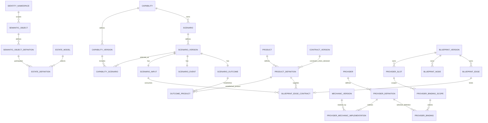

# SideFX physical SQL Server specification

**Disposition:** Approved baseline for the migration authorized by the user on 7 September 2026. This document remains the physical specification and broader acceptance catalog. [migration-001.md](C:/lab/sidefx-database/docs/migration-001.md) records what is implemented, which SQL checks have actually run, and the initial source-mapping limits. Requirements and examples below must not be read as claims that every source profile is already implemented.

**Governing baseline:** [Data architecture strategy](C:/lab/sidefx-database/docs/data-architecture-strategy.md) and the [latest semantic freeze](<C:/Users/Sidney Jones/.codex/attachments/e6dd8cf4-9da7-4414-994b-b2f8ec544371/pasted-text.txt>). Product, Provider, Mechanic, Contract, Provider Profile, and Blueprint identity are settled. Remaining exceptions below concern source mapping or physical proof, not whether those nouns exist.

**Review scope:** All requested table families and initial views. Source observations cover captured declarations even when an exact normalized mapping cannot be established. Unsupported or unresolved source cells are called out explicitly; this specification does not claim a verified mapping for every historical source profile.

## 1. Physical conventions

### 1.1 Types and notation

The catalog below is a declarative table specification, not an executable migration. Each row inherits these rules. `PK`, `AK`, `FK`, `UXF`, `CK`, and `IX` mean primary key, unfiltered alternate unique key, foreign key, filtered unique index, row CHECK, and nonunique index. `G-*` identifies an additional mandatory database gate in section 12. A constraint marked `G` must not be described as an ordinary FK or CHECK.

| Symbol / column convention | SQL Server representation | Rule |
|---|---|---|
| `K`, any `*_pk` | `bigint` | Non-null unless explicitly marked `?`; surrogate PK allocation uses `IDENTITY(1,1)` except shared PK/FK subtypes and compound-key relationships |
| `D`, any `*_digest` | `binary(32)` | Non-null unless marked `?`; SHA-256 bytes. Display views render `sha256:` plus lowercase hex; different digest roles have different column names |
| `ID` | `nvarchar(400) COLLATE Latin1_General_100_BIN2` | Required declared identifier, nonempty; preserve case and suffixes. Reject unrepresentable/overlength values into observations, never truncate |
| `CODE` | `varchar(64) COLLATE Latin1_General_100_BIN2` | Required closed vocabulary; use the explicit CK or profile vocabulary FK |
| `TXT` | `nvarchar(max)` | Required text unless marked `?`; no uniqueness/index on the entire value |
| `PTR` | `nvarchar(400) COLLATE Latin1_General_100_BIN2` | Canonical definition pointer, JSON Pointer, or another explicitly classified locator; preserve full longer source locators as TXT observations and record a mapping limit |
| `N` | `int` | Nonnegative ordinal or count, `CK >= 0`; counts use `bigint` if they can exceed the integer range |
| `B` | `bit` | Explicit true/false; nullable only where absence is a legitimate source state |
| `T` | `datetime2(7)` | UTC instant; import time never substitutes for a missing source evaluation time |
| `?` suffix | Nullable column | Genuine optional attribute/reference, never a PK or required natural-key component |

For PTR columns used in a key, the physical index uses a persisted binary key computed from the complete UTF-16 value (`varbinary(800)`), not SQL's padded string comparison. The displayed key specifications use the readable pointer column name as shorthand for that exact byte key. Root pointers and arbitrary JSON member names may be empty or contain whitespace; the semantic-ID whitespace rule does not apply to them. Source locator hashes are independently checked against their complete text.

All surrogate PKs are clustered unless a table row specifies a compound clustered PK. Natural AKs are nonclustered. Key width must be checked on the actual target; SQL Server documents separate clustered and nonclustered limits. This design keeps relationship FKs on compact surrogate tuples and uses no `nvarchar(max)` index key. [Microsoft capacity limits](https://learn.microsoft.com/en-us/sql/sql-server/maximum-capacity-specifications-for-sql-server?view=sql-server-ver17).

SQL string comparison can obscure trailing-space differences. The ID admission rule rejects leading/trailing whitespace and empty identifiers without trimming the source; observations retain rejected bytes. A profile that legitimately permits those values requires a reviewed byte-preserving identity representation before normalization. There is no case folding, suffix stripping, filename identity, or hash-only name deduplication.

### 1.2 Global constraints and indexes

1. Every PK, AK component, and mandatory FK is `NOT NULL`. Optional composite FKs have an explicit all-null-or-all-present CK. An SQL CHECK that evaluates to UNKNOWN does not reject a row; applicability checks therefore use explicit `IS NULL` / `IS NOT NULL` branches. [Microsoft CHECK semantics](https://learn.microsoft.com/en-us/sql/relational-databases/tables/unique-constraints-and-check-constraints?view=sql-server-ver17).
2. All FKs use `ON DELETE NO ACTION` and `ON UPDATE NO ACTION`. No cascading deletion of shared identities, definitions, source evidence, or membership. Published model rows are immutable under `G-IMMUTABLE`.
3. Unfiltered PKs/AKs named here are FK targets. Filtered unique indexes enforce optional labels, IDs, and context policies; they are not used as substitute parent keys. Optional values can be indexed over a defined subset. [Microsoft filtered indexes](https://learn.microsoft.com/en-us/sql/relational-databases/indexes/create-filtered-indexes?view=sql-server-ver17).
4. Create one supporting nonunique index with each distinct FK tuple as its leading columns unless an existing PK/AK/IX already has that prefix. Do not create duplicate prefix indexes. A foreign key does not automatically create its own index. [Microsoft PK/FK constraints](https://learn.microsoft.com/en-us/sql/relational-databases/tables/primary-and-foreign-key-constraints?view=sql-server-ver17).
5. `IGNORE_DUP_KEY` is OFF. No `NOCHECK`, disabled constraint, or untrusted constraint survives publication. Conflicting source facts are observations; an importer attempt to violate a normalized constraint is an importer failure.
6. Every repeating structure has a reviewed owner and member key. No repeated relational IDs inside JSON. Opaque schema bytes, fixture input payloads, and literal values may refer to content objects; their relationships remain columns and FKs.
7. `L` below means required lineage: the row resolves through its owning exact definition, canonical member pointer, and `source.source_lineage` to all contributing observations and mapping rules. `G-LINEAGE` checks exact member existence and source resolution. Identity rows obtain lineage through their definitions; analysis rows through their scoped assessment/source inputs.

Default constraint names are `PK_<table>`, `AK_<table>_<purpose>`, `FK_<table>_<target>_<role>`, `UXF_<table>_<purpose>`, and `CK_<table>_<rule>`. Names are mechanical; constraints are not omitted because a table uses an inherited template.

## 2. Canonical definition and namespace contracts

### 2.1 Identity and content are separate

The identity law is fixed: another identity row is another semantic object; another definition is another exact definition of that object; another membership or use references an existing definition.

`definition_digest` is SHA-256 of the canonical semantic-definition envelope. The proposed envelope has: format version, object kind, explicit namespace address, exact declared ID, canonical semantic fields, and exact referenced-definition addresses. It excludes surrogate PKs, snapshot IDs, import timestamps, file paths, capsule packaging, and version-label aliases. Changing a semantic field or an exact semantic reference changes the definition digest; changing a source appearance does not.

Owned members are embedded in their parent's canonical definition. The parent does not recursively include the derived digest of each owned face/member. An owned member's address/digest can then bind the parent definition digest, its role/pointer, and its exact fragment without a parent/child hash cycle. Only authority-established external definition pins enter the envelope as resolved references. An unresolved declared reference is preserved as a typed declaration descriptor; it is not replaced by a fabricated target digest. The per-profile manifest distinguishes complete bound definitions from incomplete declared definitions, and must specify that distinction in R-02's byte examples.

Use a declared canonicalization profile in `source.mapping_rule`. The proposed SQL inspection envelope uses UTF-8 JSON canonicalized with JCS; preserve array order when it is semantic and sort set-valued members by their reviewed member key before canonicalization. Reject duplicate JSON property names and values outside the chosen canonicalization profile rather than silently losing precision. This is a proposed deterministic mapping contract for review, not a claim that existing Harness digests use JCS. [RFC 8785](https://www.rfc-editor.org/rfc/rfc8785).

For a definition assembled from several authorities, the envelope contains a canonical manifest of semantic roles and exact canonical fragment/definition digests. Source appearances and raw-byte digests are lineage. Multiple copies of the same contribution do not become repeated manifest members. Every contributing role has an explicit source selector and precedence rule; conflicting contributions hold that definition unresolved. Recursive reference cycles require an authority-defined finite manifest/reference scheme; do not recursively hash an endless definition closure or invent a cycle-breaking order.

The review must approve byte-level positive and negative digest examples before implementation. No existing `raw_document_digest`, `capsule_digest`, or `referenced_authority_digest` is relabeled as `definition_digest`.

### 2.2 Namespace assignment and owned addresses

Reusable identities reference `identity_namespace`, unique by `(namespace_kind, namespace_id)`. Object-family namespace kinds remain distinct even when IDs share text. `providerId`, `platformCapabilityId`, `portId`, and `providerProfileId` map through different source roles; no string equality merges them.

`source.namespace_mapping` binds a reviewed mapping rule and source authority scope to an explicit namespace. When the source lacks a namespace property, this binding must be declared by the mapping contract. It is not inferred from a path or display name. An unbound profile produces `NAMESPACE_MAPPING_REQUIRED` and preserves its observations.

Scenario's semantic key remains `(capability_pk, scenario_id)`. The registry also needs owner-scoped addresses for Scenario, faces, and other owned semantic definitions. `model.namespace_owner` binds an owned address namespace to the owning semantic object and scope kind. Its `namespace_id` is a mechanical canonical encoding of that owner address, not a new source-declared semantic ID. `G-NAMESPACE` proves that concrete ownership and registry ownership agree. Face addresses never turn faces into independently reusable entities.

Use a bounded mechanical owner-address digest in an owned namespace ID when the canonical owner address exceeds the reviewed ID width; retain and validate the full owner tuple through namespace_owner. This never truncates a declared ID or creates a new Product/Scenario ID. A digest collision or mismatched owner tuple fails the gate rather than merging namespaces.

## 3. Source contracts inspected and mapping evidence

The reviewed local input is [snapshot 86d584…](C:/lab/sidefx-database/data/snapshots/86d58414531642348bc013dd5bb41aaa7fbb5ce75b7ae6b48847d3c91fd60fb7.json), containing 8,178 source appearances. These are historical witnesses, not a fresh claim about the current Harness estate. A later load must explicitly select its generation.

`S-*` mapping references below identify actual inspected source shapes. Paths inside capsules are selectors within this snapshot, not filesystem-derived identity rules. Schema bytes and sample bytes remain distinguishable. A sample proves field presence, not conformity to every version of a similarly named schema.

| Map | Inspected source family / witness | Source fields and target responsibility |
|---|---|---|
| S-01 | Snapshot manifest | `/snapshotId`, `/estateManifestDigest`, `/sourceHead`; `/artifacts/*/{artifactId,sourcePath,sourceClass,contentDigest,byteLength,capabilityId,capsuleDigest,authorityDigest,entryId,containerPath}` -> source snapshot, appearance, content, containment, lineage. Nullable observed owners do not become nullable Provider/Capability identity |
| S-02 | Carrier `scenario-semantic-carrier.v2`; schema digest `4956f3095cd47b720c46ecb00c0f4ba37983433347fa12800d0d25b8ea6d3433` | `/capability/{id,name,version}`, `/scenarios/*/{id,name}`, `/input/{id,name,contractRef}`, `/event/{id,name,responsibility,execution}`, `/outcome/{id,name,experience,product,terminal,terminalDisposition}` under each scenario; Product `id,name,contractRef`; `/contracts/*/{id,name,kind,shape}` |
| S-03 | Carrier v3 schema digest `9f27b1b3e1c443bebdd308b05d113bca836a08c143da877f95713146c56a1387` | S-02 plus `/management/contractSchemas/*/{contractRef,fileName,schema}`, `/transformations/*/{id,expression}`, `/eventBindings/*/{eventRef,authorityId,portId,platformCapabilityId,transformationRef}`, `/fixtures/*`, `/routeBindings/*`, `/routeGroups/*`, `/authorities/*`; all these added paths are under `/management` |
| S-04 | `capabilities/resolve-capability-proof-obligations/capability.authority.json`, digest `2bafd4db25323aa62f5326f3200f8669a270f662f73aa49b7117841ce17131e2` | `/capabilityId`, `/name`, `/rootScenarioId`, `/userStory/*`, `/experience/{experienceId,actor,promise,observableConditions}`. Does not by itself supply a source version label or all scenario faces |
| S-05 | `execution-authorities.v1`, witness digest `5e2137683d41449a650caa5858e0153c4e5ef6e853b0c79dabbd7ca6b5c78087` | `/executionAuthorities/*/{id,owningScenarioId,operations}`; operation array order, `kind`, `portId` where declared. Inspect each supported kind's exact target field; an anonymous operation has an ordinal and no invented operation ID |
| S-06 | `consumer-interface-authority.v1`, witness digest `74d7fd4d7a0ed3df402948857ca7c36c0f280a379e9716262d4e6e772ecf264f` | `/interfaces/*/{interfaceId,kind,rootScenarioId,platformCapabilityId}`, `/portBindings/*/{portId,platformCapabilityId,configuration}`, `/contractCatalog`. A platform capability selection is not automatically a declared Provider ID |
| S-07 | Contract catalog object, witness digest `f94bf33b3f31499d619dac7aed7488850bac1dc41e676da9f22d35874df8fb62` | Object property name is the declared contract ID; value is a relative schema reference. Resolve within the exact source container, retain catalog and schema lineage, deduplicate schema content. Filename is not contract identity |
| S-08 | `semantic-transformation-authority.v1`, witness digest `32de4e9264a63c876b9667e210548abcc211bae2b7f6205ec5ccf3a27a630530` | `/transformations/*/{id,expression}`; recursively normalize `op`, object member names, array ordinals, typed literals, and reference operands. An expression property named `providerSlots` is not a Provider Slot declaration |
| S-09 | Blueprint schema `canonical-circuit-blueprint.v1`, digest `dc3a4cf1c75ca3ebdf51e83b6047bde6c5cd45674798cb31a7e14d1585a12d02` | `/blueprintAuthority/{blueprintId,authorityDigest}`, `/capability/*`, `/nodes/*`, `/edges/*`, `/structuralMapping/*`; exact field mappings in sections 8 and 9. This schema's `providerSlot` requires `portId,mode` |
| S-10 | Blueprint instance digest `dc69ec8b051bd9ee83da8ef9981202cd9156c12514b6c43019d28266ef190379` | Concrete node IDs, cell identities/contracts/authorities, edge topology/progress, C4 `elementId,realizationAuthority,nodeIds`. Its `projectionAuthorities` and service-level shape differ from the inspected schema: classify that profile difference; do not claim schema conformance from matching `carrierVersion` alone |
| S-11 | Runtime plan v3 witness `capsule-runtime/admit-capability-authority/execution-plan.node.json`, digest `f3140c38f3874167619e28ac55fd827495a5944a8cf549a566229ef369ece35f` | `/canonicalGraph/requiredProviderSlots/*/{slotId,cellId,mechanicId,profileConstraints}`, `/realizationOverlay/providerBindings/*/{slotId,cellId,mechanicId,providerProfileId,providerProfileDigest,implementationRef}`. Inspected bindings have no separate Provider ID. Profile digest remains a declared reference digest until resolved. Observed mechanic slots have no port. Resolve blueprint/profile/provider mappings explicitly; preserve unmapped projected declarations |
| S-12 | `sfx-provider-catalog.v1`, digest `8ab5aec58f1c5701edfe9591014d5ffa4f223e158a51a731cba7d9f156703e0f` | `/providers/*/{providerId,name,operations,candidateCapabilities,transport,commandBindings,conformanceClaims}`. Explicit external-catalog namespace; command candidates and smoke-test claims do not establish managed implementation or qualification |
| S-13 | Mechanic profile witness digest `c203c080cedb169ffad0d94c4e0b39583c49a69321828871a8af6451aff310bd` | `/profileId`, `/requiredMechanics/*/{mechanicId,capabilityKind}`, `/providerRequirements/*`. `profileType=mechanic-profile.v1` is not a Provider Profile declaration merely because it has `profileId` |
| S-14 | `consumer-capability-fixtures.v1`, digest `cdef2260d524325b9fb1c775fc03f88f7741b52682dfb490ad9e5d6e830a048f` | `/fixtures/*/{fixtureId,input,portOutcomes,expected}`; `/expected/{disposition,terminalScenarioId,scenarioSequence,outcomeAssertions}`; assertion `conditionId,path,operator,value`. Definitions only, no fixture execution result |
| S-15 | Observed semantic graph digest `ec9b9b64bf9b70e4950aa145fc85289b134c1db677408b466aa7923959b6de3d` | `/scenarioOutcomes/*/{scenarioId,variants}`, `/edgeGroups/*`, `/transitions/*/{transitionId,from,to,selectsVariant,topologyKind,semanticProgress,bindingAuthorityId,edgeGroupId}`. Do not equate `topologyKind=selection` with a canonical blueprint role without an explicit mapping |
| S-16 | Evaluation relationship graph digest `f2cf43b8d1f5b0c63ffb6143eae50c2bda705f57cbc5a0c208f5b28f981faede` | `/proofObligations/*/{proofObligationId,subjectSemanticObjectId,disposition,basisRelationshipIds}`. Evaluation declarations have their own source classification; do not promote evidence into capability-owned admitted obligations |

Additional source profiles require the same exact mapping record. Qualification authority and independently declared Provider Profile definitions have not been established merely by the inspected catalog/plan/profile references. That is a source-resolution finding; their frozen model tables remain in this specification.

## 4. Source, membership, and address tables

### 4.1 Source and mapping relations

| Table | Columns and row grain | PK / AK / FK / CHECK; mapping and conflict behavior |
|---|---|---|
| `source.estate_snapshot` | `estate_snapshot_pk K`, `snapshot_digest D`, `estate_manifest_digest D`, `source_head ID?`, `captured_at T?`; one captured estate | PK; AK snapshot digest. S-01. Same digest with different content is corruption, not another snapshot |
| `source.content_object` | `content_object_pk K`, `content_digest D`, `content_bytes varbinary(max)`, `byte_length bigint`; one raw byte object | PK; AK digest; CK byte length nonnegative and equals actual byte length; `G-CONTENT` hashes exact bytes. Same digest/different bytes fails import |
| `source.source_appearance` | `source_appearance_pk K`, snapshot FK, content FK, `appearance_digest D`, `source_path TXT`, `source_class CODE`, `container_locator TXT?`, `capsule_digest D?`, `referenced_authority_digest D?`, `entry_id ID?`; one source occurrence | PK; AK `(estate_snapshot_pk,appearance_digest)`; FKs snapshot/content. S-01. Appearance digest binds full locator and containment; `G-CONTENT` detects collisions. Nullable observed containment is legitimate source metadata |
| `source.source_classification` | appearance FK, mapping-rule FK, `family_code CODE`, `classification_state CODE`; one profile classification under a rule | PK `(source_appearance_pk,mapping_rule_pk,family_code)`; FKs. CK state `SUPPORTED,UNSUPPORTED,AMBIGUOUS,OUTSIDE_SCOPE`. Ambiguity remains visible |
| `source.mapping_rule` | `mapping_rule_pk K`, `rule_id ID`, `rule_digest D`, `source_profile ID`, `rule_content_object_pk K`, `canonicalization_profile ID`; one exact mapping rule | PK; AK `(rule_id,rule_digest)`; FK content. Rule content declares selectors, vocabularies, namespace bindings, precedence, canonical fields and tests |
| `source.namespace_mapping` | mapping-rule FK, `object_kind CODE`, `source_scope ID`, namespace FK; one explicit mapping binding | PK `(mapping_rule_pk,object_kind,source_scope)`; FK namespace. `G-NAMESPACE` rejects wrong family or conflicting bindings; source scope is authority scope, never inferred path |
| `source.source_observation` | `source_observation_pk K`, appearance FK, `locator TXT`, `locator_digest D`, `observation_kind CODE`, `presence_state CODE`, `observed_value_content_pk K?`; one observed declaration/field/member | PK; AK `(source_appearance_pk,locator_digest,observation_kind)`; FK optional content. CK presence `PRESENT,ABSENT,EXPLICIT_NULL,NOT_APPLICABLE`; absent and null are distinct. `G-CONTENT` verifies locator digest/full locator |
| `source.declaration_observation` | `source_observation_pk PK/FK`, `declared_kind CODE`, `declared_id TXT?`, `namespace_text TXT?`; one declaration observation subtype | PK/FK observation; `G-OBSERVATION` requires kind DECLARATION. Missing or malformed IDs remain here; no corresponding entity is fabricated |
| `source.relationship_observation` | `source_observation_pk PK/FK`, `relationship_kind CODE`, `source_reference TXT?`, `target_reference TXT?`, `declared_target_digest D?`; one relationship observation subtype | PK/FK observation; `G-OBSERVATION` requires RELATIONSHIP. Resolution goes through analysis and exact typed normalized relationships |
| `source.source_lineage` | `source_lineage_pk K`, semantic-definition FK, `member_kind CODE`, `canonical_pointer PTR`, observation FK, mapping-rule FK, `contribution_role CODE`; one supporting source contribution to a definition/member | PK; AK `(semantic_object_definition_pk,member_kind,canonical_pointer,source_observation_pk,mapping_rule_pk,contribution_role)`; FKs. `G-LINEAGE` verifies the pointer names exactly one concrete member of that definition and the source supports it; a pointer string alone is not claimed as an FK |
| `source.estate_model` | `estate_model_pk K`, snapshot FK, `mapping_manifest_digest D`, `publication_state CODE`; one inspection projection under exact mappings | PK; AK `(estate_snapshot_pk,mapping_manifest_digest)`; CK state `BUILDING,PUBLISHED,FAILED`. `G-PUBLISH` owns state changes; this is inspection metadata, not a semantic entity or receipt |
| `source.estate_model_rule` | estate-model FK, mapping-rule FK; exact mapping membership | Compound PK/FKs; manifest must reproduce this set under `G-PUBLISH` |
| `source.current_model` | `singleton_id tinyint`, estate-model FK | PK singleton, CK `singleton_id=1`; only `G-PUBLISH` changes selection atomically. No timestamp/MAX-based selection |

The request's alternative names `appearance`, `source_appearance`, `coverage`, and `coverage_assessment` do not create duplicate tables. This specification uses `source.source_appearance` and `analysis.coverage_assessment`; shorter aliases may be views. Declaration and relationship observations are typed children of the single observation table.

### 4.2 Address registry and estate membership

| Table | Columns and row grain | Keys and enforcement |
|---|---|---|
| `model.identity_namespace` | `namespace_pk K`, `namespace_kind CODE`, `namespace_id ID`; one explicit identity scope | PK; AK `(namespace_kind,namespace_id)`; CK nonempty; source namespace mapping/owner rule supplies lineage |
| `model.namespace_owner` | `namespace_pk PK/FK`, `owner_semantic_object_pk K`, `scope_kind CODE`; optional owned-address namespace | FK owner -> semantic_object; AK `(owner_semantic_object_pk,scope_kind)`; `G-NAMESPACE` matches canonical owner address and prevents ownership cycles |
| `model.semantic_object` | `semantic_object_pk K`, `object_kind CODE`, `namespace_pk K`, `declared_id ID` | PK; AK `(namespace_pk,declared_id)`; AK `(semantic_object_pk,object_kind,namespace_pk,declared_id)`; FK namespace; `G-NAMESPACE` verifies family/scope; `G-SUBTYPE` requires exactly one applicable concrete identity or owned-face identity witness |
| `model.semantic_object_definition` | `semantic_object_definition_pk K`, object FK, `object_kind CODE`, `definition_digest D`, `canonical_content_pk K` | PK; AK `(semantic_object_pk,definition_digest)`; AK `(semantic_object_definition_pk,semantic_object_pk,object_kind,definition_digest)`; FK `(semantic_object_pk,object_kind)` to the corresponding additional semantic_object AK; FK content; `G-CONTENT`, `G-SUBTYPE` |
| `model.definition_version_label` | object FK, `version_label ID`, definition FK, `definition_digest D`; one declared alias mapping | PK `(semantic_object_pk,version_label)`; composite FK to definition AK `(semantic_object_definition_pk,semantic_object_pk,definition_digest)`; those discriminator-free columns have a supporting AK. Conflicting aliases stay observations, not competing valid mappings |
| `model.estate_definition` | estate-model FK, exact semantic-definition FK; one definition present in a projection | PK `(estate_model_pk,semantic_object_definition_pk)`; `G-PUBLISH` verifies support and referenced-definition closure; multiple versions of shared objects may participate |
| `model.estate_capability` | estate-model FK, capability FK, capability-version FK, semantic-definition FK | PK `(estate_model_pk,capability_pk)`; composite FK capability/version, composite FK version/definition, and FK `(estate_model_pk,semantic_object_definition_pk)` -> estate_definition. Exactly one selected capsule-backed version per capability per selected estate |

Concrete identities and definitions use the exact templates in section 5. The redundant key columns on subtype and membership relations are equality witnesses maintained by composite FKs, not independent copies of semantic meaning. Registry payload remains limited to addresses and content identity.

`G-SUBTYPE` is required because an FK from a child to a parent does not ensure every parent has exactly one child. Immediate discriminator FKs prevent wrong-kind children. A mandatory database publication gate rejects missing children; published rows cannot later lose their subtype. Section 12 specifies the permission and concurrency boundary rather than relying on an importer convention.

## 5. Reusable identity and exact-definition templates

### 5.1 Template I: reusable identity

For each family in the next table, `I(name,kind,id_column)` expands to:

- Columns: `<name>_pk K`, `namespace_pk K`, `<id_column> ID`, `semantic_object_pk K`, `object_kind CODE`.
- PK `<name>_pk`; AK `(namespace_pk,id_column)`; AK `semantic_object_pk`; AK `(<name>_pk,semantic_object_pk)`.
- FK namespace; FK `(semantic_object_pk,object_kind,namespace_pk,id_column)` -> `semantic_object` matching AK. CK `object_kind = <fixed family kind>`.
- ID rules in section 1; source mapping and lineage through exact definitions. No family adds a nullable capability-owner column.

### 5.2 Template V: independently governed definition

`V(table,identity_table,identity_pk,kind)` expands to:

- Columns: `<table>_pk K`, identity FK, `semantic_object_pk K`, `semantic_object_definition_pk K`, `object_kind CODE`, `definition_digest D`, and the semantic columns listed below. Names use the conventional `capability_version_pk`, `product_definition_pk`, etc.
- PK definition PK; AK `(identity_pk,definition_digest)`; AK `semantic_object_definition_pk`; AK `(identity_pk,definition_pk)`; AK `(definition_pk,semantic_object_definition_pk)`.
- Composite FK `(identity_pk,semantic_object_pk)` -> concrete identity AK. Composite FK `(semantic_object_definition_pk,semantic_object_pk,object_kind,definition_digest)` -> registry definition AK. CK fixed family kind.
- Required `L`; `G-CONTENT`, `G-SUBTYPE`, `G-IMMUTABLE`. Exact reference columns use FKs to concrete definitions, not only registry strings.
- Version labels are stored once in `definition_version_label` and exposed as optional aliases by definition views. This realizes the requested optional label semantics without limiting a definition to one alias or making absent labels violate uniqueness.

| Identity / definition tables | Kind; declared ID | Definition semantic columns / source mapping |
|---|---|---|
| `capability` / `capability_version` | CAPABILITY; `capability_id` | `name TXT`, user-story actor/intent/outcome TXT?; experience identity/actor/promise TXT?; root scenario through `capability_root_scenario`. S-02/03/04; source profile determines required descriptive fields |
| `product` / `product_definition` | PRODUCT; `product_id` | `name TXT`, `contract_version_pk K?`, `contract_reference_state CODE`; FK contract_version; CK state/resolution agreement. S-02/03 exact Product fragment; no outcome identity embedded in the reusable key |
| `contract` / `contract_version` | CONTRACT; `contract_id` | `name TXT?`, `contract_kind CODE?`, `schema_object_pk K?`, `schema_reference_state CODE`; FK schema_object; S-02/03/07. Complete-contract view requires the applicable resolved schema; valid independent identity can remain incomplete |
| `execution_authority` / `execution_authority_version` | EXECUTION_AUTHORITY; `execution_authority_id` | `authority_profile ID`; S-03 eventBindings + S-05 declarations; owner scenario use is a separate relation |
| `transformation` / `transformation_version` | TRANSFORMATION; `transformation_id` | `expression_profile ID`; S-03/08, with AST members below |
| `mechanic` / `mechanic_version` | MECHANIC; `mechanic_id` | `name TXT?`, `mechanic_kind CODE?`, `definition_profile ID`; S-02/03 execution mechanics. A reference to a mechanic/operator alone does not provide its independent definition |
| `port` / `port_version` | PORT; `port_id` | `name TXT?`, `port_profile ID`; S-06 or explicit port authority. Selection-only declarations can establish observations but do not fabricate an interface definition |
| `provider` / `provider_definition` | PROVIDER; `provider_id` | `name TXT?`, `declaration_profile ID`; S-12 external catalog and separately classified actual provider authorities. Platform capability IDs require explicit provider mapping |
| `provider_profile` / `provider_profile_version` | PROVIDER_PROFILE; `provider_profile_id` | `profile_name TXT?`, `profile_authority ID`; only actual Provider Profile declarations. S-11 is a reference witness, S-13 is a different profile family |
| `blueprint` / `blueprint_version` | BLUEPRINT; `blueprint_id` | `capability_pk K`, `capability_version_pk K`, `carrier_profile ID`, `source_disposition CODE`; composite FK capability/version; S-09/10; source disposition is not computed admission |

Reference states are `RESOLVED,ABSENT,EXPLICIT_NULL,UNRESOLVED,NOT_APPLICABLE`, with FK present iff RESOLVED. Applicable required references missing from source prevent the complete view/gate, not valid independent identity storage. Diagnostics distinguish unresolved from genuinely inapplicable relationships.

### 5.3 Capability, Scenario, faces, and Product relationships

| Table | Row grain and columns | Keys, FKs, checks, lineage, and mapping |
|---|---|---|
| `scenario` | `scenario_pk K`, `capability_pk K`, `scenario_id ID`, `semantic_object_pk K`, `namespace_pk K`, `object_kind CODE=SCENARIO` | PK; AK `(capability_pk,scenario_id)`; AK `(capability_pk,scenario_pk)`; AK semantic_object_pk; AK `(scenario_pk,semantic_object_pk)`; FK capability and registry composite as I; `G-NAMESPACE` checks owner namespace. S-02/03 and approved feature/authority composition |
| `scenario_version` | V adapted to scenario identity; `name TXT`, `source_profile ID` | V's keys/FKs, including AK `(scenario_pk,scenario_version_pk)`. Faces are children of this definition, never shared global nouns |
| `capability_scenario` | `capability_pk`, `capability_version_pk`, `scenario_pk`, `scenario_version_pk`; one exact membership | PK `(capability_version_pk,scenario_pk)`; AK `(capability_version_pk,scenario_version_pk)`; composite FKs `(capability_pk,capability_version_pk)`, `(capability_pk,scenario_pk)`, `(scenario_pk,scenario_version_pk)` to corresponding AKs. `L`; no different-capability scenario or substituted scenario version |
| `capability_root_scenario` | `capability_version_pk PK/FK`, `scenario_pk`; root use | Composite FK `(capability_version_pk,scenario_pk)` -> capability_scenario; one root where required. S-02/04 rootScenario reference; `G-SCENARIO` requires it for the applicable profile |
| `scenario_input` | `scenario_version_pk PK/FK`, `input_id ID`, `name TXT?`, `input_contract_version_pk K?`, reference state, exact face registry address | FK contract_version; address rules below; one Input per exact scenario; S-02/03, source composed face mappings. `G-SCENARIO` requires resolved input contract where mandated |
| `scenario_event` | `scenario_version_pk PK/FK`, `event_id ID`, `name TXT?`, `responsibility TXT`, `execution_authority_version_pk K?`, reference state, exact face registry address | FK execution_authority_version; address rules below; S-02/03 plus event binding resolution. Optional authority stays distinct from a required unresolved authority |
| `scenario_outcome` | `scenario_version_pk PK/FK`, `outcome_id ID`, `name TXT?`, `experience TXT`, `terminal B?`, `terminal_disposition ID?`, exact face registry address | CK terminal/profile rules via `G-SCENARIO`; absent terminality is not false. S-02/03; no copied Product contract |
| `outcome_variant` | `outcome_variant_pk K`, `scenario_version_pk K`, `variant_id ID`, `terminal B?` | PK; AK `(scenario_version_pk,variant_id)`; AK `(scenario_version_pk,outcome_variant_pk)`; FK scenario_outcome; `L`. S-09 cell variants, S-15 observed variants only through approved authority mapping |
| `outcome_product` | `scenario_version_pk`, `product_definition_pk`; unconditional establishment | Compound PK; FK scenario_outcome, product_definition; `L`; S-02/03 singular Product contributes one link |
| `outcome_variant_product` | `outcome_variant_pk`, `product_definition_pk`; conditioned establishment | Compound PK; FKs variant/Product definition; `L`; profile must explicitly declare conditioned establishment. No nullable variant column |
| `scenario_outcome_contract` | `scenario_version_pk PK/FK`, `contract_version_pk K` | FK scenario_outcome and contract_version; `L`. Only a separately declared outcome contract; absent source means no row |
| `schema_object` | `schema_object_pk K`, `content_digest D`, `dialect ID?`, `content_object_pk K` | PK; AK digest; AK content_object_pk; FK content; `G-CONTENT` requires matching exact bytes/digest. Dialect declared by schema/profile, not guessed. Distinct contracts can reference the same row |
| `port_contract` | `port_version_pk`, `direction CODE`, `member_ordinal N`, `role ID?`, `contract_version_pk` | PK `(port_version_pk,direction,member_ordinal)`; FKs port_version/contract_version; UXF `(port_version_pk,direction,role)` WHERE role IS NOT NULL; direction vocabulary belongs to port profile; `L` |

Face registry columns are `semantic_object_pk`, `semantic_object_definition_pk`, `namespace_pk`, `object_kind`, and `definition_digest`, all required. Each face adds AK semantic_object_definition_pk and a composite registry-definition FK. Its declared face ID and fixed kind bind the registry identity; `G-NAMESPACE` proves that identity is scenario-owned. The face's exact definition digest includes its owning scenario-definition address. This supplies exact blueprint addresses without creating reusable Input/Event/Outcome entity tables.

`v_complete_scenario` requires Input, Event, and Outcome through three inner joins, plus applicable required-reference checks. Shared PKs prove at most one; the view predicate and `G-SCENARIO` prove completeness. An incomplete observed scenario remains visible through `v_scenario` and coverage.

## 6. Execution, transformation, and mechanic use

All members in this section have `L` to their owning execution/transformation definition. Source anonymous order is a valid member key; it is never exposed as a declared ID.

| Table | Columns / row grain | Keys, FKs, CHECKs, and mapping |
|---|---|---|
| `execution_operation` | `execution_operation_pk K`, `execution_authority_version_pk K`, `operation_id ID?`, `ordinal N`, `operation_kind CODE`; one declared step | PK; AK `(execution_authority_version_pk,ordinal)`; AK `(execution_authority_version_pk,execution_operation_pk)`; AK `(execution_operation_pk,operation_kind)`; UXF `(execution_authority_version_pk,operation_id)` WHERE operation_id IS NOT NULL; FK authority version. S-05 order/kind, S-02/03 declarative operations under their own profile |
| `operation_port_invocation` | `execution_operation_pk PK/FK`, fixed `operation_kind=invoke-port`, `port_version_pk K` | Composite FK operation/kind; FK port_version; CK fixed kind. S-05 kind-specific port reference resolved through S-06; unresolved target -> observation, not nullable target |
| `operation_scenario_invocation` | `execution_operation_pk PK/FK`, fixed `operation_kind=invoke-scenario`, `target_scenario_version_pk K` | Composite FK operation/kind; FK scenario_version; CK fixed kind; `G-EXECUTION` verifies allowed composition scope. Exact target field is bound by the execution profile, never inferred from operation name |
| `operation_state_projection` | `execution_operation_pk PK/FK`, fixed `operation_kind=project-state`, `transformation_version_pk K` | Composite FK operation/kind; FK transformation_version. Map only the profile declaring that transformation relationship; other state-projection forms remain observations until explicitly mapped |
| `operation_mechanic` | `execution_operation_pk`, `mechanic_version_pk`, `role CODE`; one mechanic use | Compound PK; FKs operation/mechanic_version; role supplied by source/profile mapping, not Provider name. S-02/03 `mechanicRefs`; S-11 projected reference requires authority mapping |
| `operation_predecessor` | owning execution-authority version, operation PK, predecessor-operation PK | PK `(execution_operation_pk,predecessor_operation_pk)`; both composite FKs share authority version; CK operation != predecessor; `G-EXECUTION` validates the applicable dependency/order grammar. S-02/03 predecessorRefs |
| `transformation_expression_node` | `expression_node_pk K`, `transformation_version_pk K`, `node_pointer PTR`, `node_kind CODE`, `operator ID?`, `literal_content_pk K?`, `reference_name TXT?` | PK; AK `(transformation_version_pk,node_pointer)`; AK `(transformation_version_pk,expression_node_pk)`; FK transformation/content; CK kind `OPERATOR,OBJECT,ARRAY,LITERAL,REFERENCE` with exactly the applicable payload fields. S-08 recursive expression |
| `transformation_expression_child` | transformation version, parent-node PK, child-node PK, `member_kind CODE`, `member_name nvarchar(400)?`, computed binary `member_name_key varbinary(800)?`, `ordinal N?` | PK `(parent_node_pk,child_node_pk)`; both composite FKs share transformation version; AK child_node_pk for a tree; CK parent != child; CK OBJECT_MEMBER requires name and no ordinal, ARRAY_MEMBER requires ordinal and no name; UXF `(parent_node_pk,member_name_key)` where name present; UXF `(parent_node_pk,ordinal)` where ordinal present. Empty/whitespace JSON property names are valid grammar data; binary keys preserve them |
| `transformation_root` | `transformation_version_pk PK/FK`, `expression_node_pk K` | Composite FK transformation/node; one root; `G-EXPRESSION` requires the root to have no parent, every other node one parent, reachability, no cycle, and member kind consistent with parent kind |
| `operation_transformation` | operation PK, transformation-version PK, `role CODE` | Compound PK/FKs; additional explicitly declared use such as S-03 event binding or S-06 transformation configuration; never a second ownership claim for the transformation |

The expression structure is an AST, not a generic semantic attribute/value system. Object member names and literal payloads are grammar data. Governed references from expressions to another semantic definition additionally use `expression_semantic_reference(expression_node_pk PK/FK, semantic_object_definition_pk FK, expected_kind CODE)`; the registry discriminator FK and `G-EXPRESSION` verify the target family and reference role. Unresolved textual variables remain REFERENCE nodes, with reference observations; they do not become fabricated semantic targets.

`operation_kind` is profile-bound. The three S-05 kinds do not erase carrier operations, effects, or provider-boundary declarations that have a different grammar. Until a kind has a reviewed concrete target mapping, retain its declaration and report `UNSUPPORTED_OPERATION_PROFILE`; do not create the wrong subtype. `G-EXECUTION` distinguishes incomplete observed authority from a complete executable authority view.

## 7. Provider requirements, implementations, and binding

### 7.1 Reusable implementation declarations

Implementation keys must distinguish genuine profile/role contexts without inventing a `default` profile. Let `IKEY` mean provider definition plus exact target port/mechanic version. Both implementation tables use four filtered unique indexes:

- `IKEY` WHERE profile and role are both absent.
- `IKEY, provider_profile_version_pk` WHERE profile is present and role absent.
- `IKEY, role` WHERE profile absent and role present.
- `IKEY, provider_profile_version_pk, role` WHERE both are present.

These four disjoint filters cover all rows and prevent duplicate declarations in every applicability shape. Ordinary surrogate/composite AKs, not these filtered indexes, are the binding FK targets.

| Table | Columns / grain | Keys, constraints, lineage, and mapping |
|---|---|---|
| `provider_port_implementation` | `provider_port_implementation_pk K`, provider-definition FK, port-version FK, `provider_profile_version_pk K?`, `role ID?`; one implementation declaration | PK; IKEY filters; AK `(provider_definition_pk,provider_port_implementation_pk,port_version_pk)`; FK optional profile; `L`. Requires explicit classified implementation declaration, not S-12 candidate command |
| `provider_mechanic_implementation` | analogous PK, provider-definition FK, mechanic-version FK, optional profile/role | PK; IKEY filters; AK `(provider_definition_pk,provider_mechanic_implementation_pk,mechanic_version_pk)`; FKs; `L`. One realization relationship, no new Mechanic identity |
| `provider_capability_implementation` | provider-definition FK, capability-version FK, `role CODE`; exact implementing-capability relationship where declared | Compound PK/FKs; `L`; keeps implementation distinct from consuming capability impact |
| `provider_profile_constraint` | profile-version FK, `ordinal N`, `constraint_kind CODE`, `constraint_term TXT`, `operand_content_pk K?` | PK `(provider_profile_version_pk,ordinal)`; FK optional literal content; `L`; concrete profile grammar validates term/operand. No inference from a mechanic-profile document |
| `provider_slot` | `provider_slot_pk K`, `blueprint_version_pk K`, `slot_id ID`, `owner_node_pk K`; one realization requirement | PK; AK `(blueprint_version_pk,slot_id)`; AK `(blueprint_version_pk,provider_slot_pk)`; AK `(provider_slot_pk,blueprint_version_pk,owner_node_pk)`; composite FK blueprint/node; `L`. S-09 explicit blueprint slot, S-11 only after exact geometry mapping |
| `slot_port_requirement` | `slot_port_requirement_pk K`, slot FK, `port_version_pk K`, `ordinal N`, `role ID?` | PK; AK `(provider_slot_pk,ordinal)`; AK `(provider_slot_pk,slot_port_requirement_pk,port_version_pk)`; UXF `(provider_slot_pk,port_version_pk)` where role null and corresponding `(slot,port,role)` where role present; FK port; `L` |
| `slot_mechanic_requirement` | analogous requirement PK, slot FK, mechanic-version FK, ordinal, optional role | Same keys with mechanic target; `L`; S-11 does not manufacture port requirements |
| `slot_profile_requirement` | `slot_profile_requirement_pk K`, slot FK, provider-profile-version FK, ordinal, optional role | Same keys with exact profile target; `L`. Referenced but undefined Provider Profile stays unresolved |
| `slot_profile_constraint` | slot FK, `ordinal N`, `constraint_kind CODE`, `constraint_term TXT`, `operand_content_pk K?` | PK `(provider_slot_pk,ordinal)`; FK optional content; `L`. S-11 `profileConstraints` terms such as `deterministic` are constraints, not fabricated profile IDs |
| `binding_context` | `binding_context_pk K`, `context_digest D`, `target_id ID?`, `environment_id ID?`, `provider_profile_version_pk K?`, canonical-content FK | PK; AK digest; FK profile/content; CK at least one declared dimension; `G-CONTENT` verifies canonical context, `G-BINDING` enforces supported dimensions. No context row for a source with no context |
| `provider_binding_scope` | `provider_binding_scope_pk K`, slot FK, `binding_context_pk K?`, `binding_role ID?`, `selection_policy CODE` | PK; AK `(provider_binding_scope_pk,provider_slot_pk,selection_policy)`; FK context. Four UXFs partition absent/present context and role, unique on slot plus the present dimensions. CK policy `SINGLE,ORDERED_SET`; policy comes from the exact source profile, not importer preference |
| `provider_binding` | `provider_binding_pk K`, scope FK, slot FK, `selection_policy CODE`, provider-definition FK, `ordinal N?` | PK; composite FK scope/slot/policy; AK `(provider_binding_pk,provider_slot_pk,provider_definition_pk)`; UXF scope WHERE policy=SINGLE; UXF `(scope,ordinal)` WHERE policy=ORDERED_SET; AK `(scope,provider_definition_pk)`; CK SINGLE has no ordinal, ORDERED_SET requires ordinal; `L` |
| `binding_port_implementation` | binding PK, slot PK, provider-definition PK, port-requirement PK, port-version PK, implementation PK | PK `(provider_binding_pk,slot_port_requirement_pk)`; composite FKs to binding AK, requirement `(slot,requirement,target)`, implementation `(provider,implementation,target)`. All columns required; `L`; selected implementation must belong to selected provider and implement required port |
| `binding_mechanic_implementation` | analogous binding, slot, provider, mechanic requirement/target, implementation | PK `(provider_binding_pk,slot_mechanic_requirement_pk)`; three analogous composite FKs; `L` |
| `provider_slot_operation` | slot FK, operation FK; explicitly mapped use | Compound PK/FKs; `L`; `G-BINDING` verifies source mapping and composition scope. Supplies impact paths; slot existence does not imply an operation association |

`binding_context` is an exact context value, not a reusable SideFX semantic noun. Its digest covers every supported declared context dimension. If a source supplies dimensions outside this typed shape, hold that context mapping unresolved rather than dropping them from the uniqueness key. An unordered or weighted selection policy requires its reviewed member shape before normalization; do not reinterpret it as SINGLE or ORDERED_SET.

### 7.2 Binding completeness and qualification

`G-BINDING` checks every required slot port/mechanic/profile requirement, scope multiplicity, and exact provider implementation link. At least one matching implementation row is not enough if the slot declares several mandatory requirements. Profile constraints are separately reported as evaluated or not evaluated; structural FK validity does not prove semantic satisfaction.

`analysis.provider_qualification_assessment` is separate from implementation and selection. Columns: `provider_qualification_assessment_pk K`, estate-model FK, provider-definition FK, `provider_profile_version_pk K?`, `provider_slot_pk K?`, `scope_digest D`, `input_set_digest D`, `authority_definition_pk K`, `rule_definition_pk K`, `result_code ID`, `evaluated_at T?`, `effective_until T?`, source-observation FK. PK; AK `(estate_model_pk,provider_definition_pk,scope_digest,input_set_digest,authority_definition_pk,rule_definition_pk)`; all listed references are FKs to the named concrete tables or registry definitions for authority/rule; optional period CK requires end >= start when both are declared. `G-ASSESSMENT` validates expected authority kinds, scope, and exact input support. A scope with no declared time is not assigned import time.

No assessment row is fabricated for a missing qualification. Provider views expose `NOT_EVALUATED` when there is no applicable mapped durable assessment. Observed qualification result codes retain their source vocabulary and scope. Runtime readiness is `OUTSIDE_CURRENT_MODEL`; an assessment is not execution authorization. S-12 conformance claims and a plan's providerProfileId are insufficient to populate qualification authority.

## 8. Blueprint geometry and semantic references

All blueprint-owned relations have `L` to the exact Blueprint definition. No projected execution topology supplies missing blueprint ownership by inference.

| Table | Columns / grain | Keys, FKs, CHECKs, and source mapping |
|---|---|---|
| `blueprint_node` | `blueprint_node_pk K`, blueprint-version FK, `node_id ID`, `node_kind CODE`, `altitude CODE`, `projection_ordinal N`, `semantic_object_definition_pk K?`, `expected_semantic_kind CODE?`, `terminal_disposition ID?` | PK; AK `(blueprint_version_pk,node_id)`; AK `(blueprint_version_pk,blueprint_node_pk)`; FK exact semantic address plus kind using registry AK `(semantic_object_definition_pk,object_kind)`; both optional fields all-null/all-present. S-09/10 `/nodes/*`; node kind/altitude checked against profile vocabulary |
| `blueprint_node_face` | node FK, `position CODE`, exact semantic-definition FK, expected kind | PK `(blueprint_node_pk,position)`; CK position `FIRST,ENERGIZED,RESULT`; composite registry definition/kind FK; `G-GEOMETRY` validates altitude-specific meaning. Maps `cell.first`, `cell.energized`, `cell.result`; no copied semantic payload |
| `blueprint_node_scenario` | `blueprint_version_pk`, `blueprint_node_pk PK`, `scenario_version_pk` | Composite FK blueprint/node; FK scenario_version; AK `(blueprint_version_pk,blueprint_node_pk,scenario_version_pk)`; `G-GEOMETRY` proves this scenario agrees with the node's resolved faces; only applicable scenario-level nodes have a row |
| `blueprint_edge` | `blueprint_edge_pk K`, blueprint-version FK, `edge_id ID`, `from_node_pk K`, `to_node_pk K`, `topology_role CODE`, `contract_relation CODE?`, `semantic_progress CODE?`, `source_scenario_version_pk K?`, `selecting_variant_pk K?`, `semantic_precedence CODE`, `projection_ordinal N`, `binding_authority_definition_pk K` | PK; AK `(blueprint_version_pk,edge_id)`; AK `(blueprint_version_pk,blueprint_edge_pk)`; AK `(blueprint_edge_pk,contract_relation)`; both endpoint composite FKs share blueprint version. Optional pair source scenario/variant is all-null/all-present; composite FKs `(blueprint_version_pk,from_node_pk,source_scenario_version_pk)` -> node_scenario and `(source_scenario_version_pk,selecting_variant_pk)` -> outcome_variant. FK binding authority registry definition with expected authority-kind validation. S-09/10 `/edges/*` |
| `blueprint_edge_contract` | `blueprint_edge_pk PK/FK`, `contract_relation CODE`, Product-definition FK, `downstream_scenario_version_pk K`, `compatibility_authority_definition_pk K?` | Composite FK edge/relation prevents disagreement with parent discriminator; FK downstream scenario_input, Product definition, optional authority registry definition; CK relation SATISFIES or REQUIRES; `G-GEOMETRY` validates Product establishment at source endpoint and Input at target endpoint. S-09 contract role plus explicit semantic bindings |
| `blueprint_convergence_requirement` | blueprint version, `convergence_node_pk`, Product-definition FK | PK `(convergence_node_pk,product_definition_pk)`; composite FK blueprint/node; `G-GEOMETRY` requires node kind convergence and exact declared requiredProducts membership. Multiple inbound edges do not manufacture rows |
| `blueprint_fan_out_set` | `blueprint_fan_out_set_pk K`, blueprint-version FK, `fan_out_set_id ID` | PK; AK `(blueprint_version_pk,fan_out_set_id)`; AK `(blueprint_version_pk,blueprint_fan_out_set_pk)`; S-09 declared `fanOutSetId`; no grouping from graph adjacency |
| `blueprint_fan_out_member` | blueprint version, fan-out set PK, edge PK | PK `(blueprint_fan_out_set_pk,blueprint_edge_pk)`; AK edge PK; both composite FKs share blueprint version; `G-GEOMETRY` requires edge FAN_OUT_MEMBER and consistent originating branch/fan-out grammar |
| `blueprint_bounded_return` | `blueprint_edge_pk PK/FK`, `return_kind CODE`, `declared_bound_content_pk K`, `authority_definition_pk K` | FK exact bound content/authority; CK kind REPAIR,RESUMPTION,ITERATION; `G-GEOMETRY` checks edge kind, positive finite/profile-valid bound and authority. Preserve the actual declared bound shape, not an invented integer |

A node may be a pure geometry junction without its own semantic subject; its applicable faces/requirements still follow the profile. An unresolved required semantic reference is a finding and excludes the node from a complete circuit view. It is not a fabricated subject row.

The node/edge property names map directly from S-09: `kind -> node_kind`, `topology -> topology_role`, `from/to -> same-blueprint node FKs`, `semanticProgress -> semantic_progress`, `selectingVariant -> source-owned variant`, `semanticPrecedence -> semantic_precedence`, `projectionOrdinal -> projection_ordinal`, and `bindingAuthority -> exact authority reference`. S-10 illustrates actual fields but does not override S-09's schema requirements where its profile differs.

The four independent edge dimensions remain queryable. The contract relation discriminator is repeated in the child only as a composite FK witness, not a second authored fact. `G-GEOMETRY` requires exactly one contract child when that discriminator is present and none when absent.

### 8.1 Row and profile constraints

- Topology CK: TRANSITION, BRANCH_ROUTE, FAN_OUT_MEMBER, CONVERGENCE_REQUIREMENT, ALTITUDE_DESCENT, BOUNDED_RETURN.
- Optional contract CK: explicit null or SATISFIES/REQUIRES. Optional progress CK: explicit null or NARROWS/ESTABLISHES/TERMINATES/DESCENDS/BOUNDED_RETURN.
- BRANCH_ROUTE requires a selecting variant and its source scenario. Other selecting-variant applicability follows the exact bounded-return/profile rule; nonapplicable selection must be absent.
- BOUNDED_RETURN requires its bound extension and declared BOUNDED_RETURN progress. ALTITUDE_DESCENT requires the profile's descent role and a valid endpoint altitude change. Convergence requirements require REQUIRES where mandated by the blueprint profile.
- S-09's conditional grammar is reproduced in the mapping rule and `G-GEOMETRY`; do not infer a branch, convergence, or semantic progress from an edge label or ordinal.
- Every cross-row condition is tested at `G-GEOMETRY`; claims about all descendants, reachability, or convergence completeness are not falsely represented as row CHECKs.

For the inspected S-09 profile specifically, TRANSITION, FAN_OUT_MEMBER, and ALTITUDE_DESCENT require progress and forbid selection; BRANCH_ROUTE requires selection and progress; CONVERGENCE_REQUIREMENT requires REQUIRES and forbids selection; ALTITUDE_DESCENT requires DESCENDS; BOUNDED_RETURN requires its bound extension and BOUNDED_RETURN progress; FAN_OUT_MEMBER requires declared set membership. These are explicit source-schema conditions, not inferred topology conventions.

## 9. Proof definitions and structural projection

### 9.1 Owned definition convention

Fixture, observable-condition, proof-obligation, and C4 rows below are **owned definition rows**, not duplicated global identities per import. They are unique within their exact owning definition. Their owner supplies version context; stable owned addresses use `namespace_owner`. When one is a semantic address target, it carries the same fixed-kind identity/definition registry binding as a scenario face, with a unique exact definition address. `G-SUBTYPE` recognizes those concrete owned definitions without creating a second payload in the registry.

| Table | Columns / grain | Keys, FKs, checks, source map |
|---|---|---|
| `fixture` | `fixture_pk K`, `owner_definition_pk K`, `fixture_id ID`, `fixture_profile ID`; one owned fixture definition | PK; AK `(owner_definition_pk,fixture_id)`; FK owner registry definition, expected owner kind/profile at `G-PROOF`; owned-address binding and `L`. S-03/14 fixtureId |
| `fixture_case` | `fixture_case_pk K`, fixture FK, `case_id ID?`, `ordinal N`, input-content FK, `expected_disposition ID?`, `terminal_scenario_version_pk K?` | PK; AK `(fixture_pk,ordinal)`; AK `(fixture_pk,fixture_case_pk)`; UXF `(fixture_pk,case_id)` where present; FKs. Single-case fixtures have anonymous ordinal 0, not a fabricated declared case ID. S-14 input/expected |
| `fixture_assertion` | `fixture_assertion_pk K`, case FK, `ordinal N`, `condition_id ID?`, `path TXT`, `operator ID`, `expected_value_content_pk K` | PK; AK `(fixture_case_pk,ordinal)`; FKs case/content; assertion operator vocabulary under exact profile; `L`. S-14 expected.outcomeAssertions; JSON null is a content value, not an absent assertion |
| `fixture_scenario_step` | case FK, `ordinal N`, scenario-version FK | Compound PK `(fixture_case_pk,ordinal)`; FKs; `G-PROOF` validates expected composition scope. S-14 expected.scenarioSequence; order preserved |
| `fixture_port_outcome` | case FK, port-version FK, `ordinal N`, content FK | PK `(fixture_case_pk,port_version_pk,ordinal)`; FKs; `L`. S-14 portOutcomes exact reference resolution; a missing port stays an observation |
| `observable_condition` | `observable_condition_pk K`, owner-definition FK, `condition_id ID`, `statement TXT?`, owned-address binding | PK; AK `(owner_definition_pk,condition_id)`; FK owner; `L`. S-04 experience.observableConditions, other explicit declarations. An assertion's conditionId reference alone does not invent the condition definition |
| `fixture_assertion_condition` | assertion FK, observable-condition FK | Compound PK/FKs; `G-PROOF` ensures condition ID, authority scope and exact definition agree. Separate reference permits unresolved condition observations without corrupting the assertion's literal test data |
| `proof_obligation` | `proof_obligation_pk K`, owner-definition FK, `proof_obligation_id ID`, `obligation_kind CODE`, `statement TXT?`, owned-address binding | PK; AK `(owner_definition_pk,proof_obligation_id)`; FK owner; `L`. Source-profile-specific declaration required; S-16 proofObligationId identifies an evaluation-scope declaration, not automatic managed authority |
| `proof_obligation_subject` | obligation FK, exact subject-definition FK, `role CODE` | Compound PK/FKs; required subject set checked at `G-PROOF`; no nullable subject identity in the relation |
| `proof_obligation_fixture` | obligation FK, fixture-case FK, `role CODE` | Compound PK/FKs; declared coverage relationship only. A passing fixture execution receipt does not create a definition relation |
| `c4_context` | `c4_context_pk K`, blueprint-version FK, `element_id ID`, realization-authority-definition FK, owned-address binding | PK; AK `(blueprint_version_pk,element_id)`; AK `(blueprint_version_pk,c4_context_pk)`; `L`; S-09/10 structuralMapping.context |
| `c4_container` | analogous container PK, blueprint version, element ID, realization authority, `c4_context_pk K?`, owned-address binding | Same keys; optional composite FK `(blueprint_version_pk,c4_context_pk)` -> context; parent recorded only where containment is established, not inferred from the three field names |
| `c4_component` | analogous component PK, blueprint version, element ID, realization authority, `c4_container_pk K?`, owned-address binding | Same keys; optional same-blueprint parent FK; `L` |
| `c4_code_mapping` | `c4_code_mapping_pk K`, blueprint-version FK, `ordinal N`, `element_id ID?`, `c4_component_pk K?`, realization-authority-definition FK, `code_locator TXT?` | PK; AK `(blueprint_version_pk,ordinal)`; UXF `(blueprint_version_pk,element_id)` where present; optional same-blueprint component FK; `L`; map only declared code realization, not a filename-derived semantic identity |

Normalize each C4 `nodeIds` list using `c4_context_node`, `c4_container_node`, `c4_component_node`, and `c4_code_mapping_node`. Each table has columns `blueprint_version_pk`, its exact C4 parent PK, and `blueprint_node_pk`; compound PK `(parent_pk,blueprint_node_pk)` and two same-blueprint composite FKs. Add AK `(blueprint_version_pk,c4_code_mapping_pk)` to the code parent. `G-STRUCTURE` verifies the declared hierarchy/mapping; these members do not create new Capability or Scenario definitions.

### 9.2 Referenced authority definitions

The physical design also needs concrete targets for binding, compatibility, realization, and proof authority references. Add `model.authority` and `model.authority_definition` using I/V, kind AUTHORITY, ID column `authority_id`, with definition attributes `authority_kind CODE` and `authority_profile ID`. These are the explicit address targets for governed authority declarations that are not already one of the concrete semantic families. A reference to an existing ExecutionAuthority or Blueprint uses that concrete kind instead; it is not copied into AUTHORITY.

Only a classified declared authority with exact content gets a definition. Missing referenced digests or unsupported authority profiles remain unresolved observations. `G-SUBTYPE` requires a concrete AUTHORITY subtype for its registry kind; `G-ASSESSMENT` / `G-GEOMETRY` restrict which authority kinds can govern each role. This prevents arbitrary registry rows from pretending to be compatibility or qualification authority.

## 10. Observed downstream representations

Blueprint owns designed topology. The following are observed declarations and their resolution, never a second authoritative transition graph.

| Table | Columns / grain | Keys, FKs, and mapping |
|---|---|---|
| `observed_semantic_graph_transition` | `source_observation_pk PK/FK`, `transition_id ID?`, `from_scenario_ref TXT?`, `from_outcome_ref TXT?`, `to_scenario_ref TXT?`, `to_input_ref TXT?`, `declared_topology ID?`, `declared_progress ID?`, `selected_variant_ref TXT?` | FK relationship_observation; one exact observed transition appearance; S-15. Missing fields remain observed defects, not normalized graph nodes |
| `observed_execution_scenario_invocation` | `source_observation_pk PK/FK`, `execution_authority_ref TXT?`, `operation_ordinal N`, `target_scenario_ref TXT?` | FK relationship_observation; S-05 invoke-scenario occurrence. This is a declared invocation, not a runtime traversal |
| `observed_transition_resolution` | estate-model FK, transition-observation FK, source/target scenario-version FKs, `selecting_variant_pk K?` | PK `(estate_model_pk,source_observation_pk)`; optional source-scenario/variant composite FK; exact source/target FKs. Required targets absent -> no resolved row, plus unresolved_reference |
| `observed_invocation_resolution` | estate-model FK, invocation-observation FK, operation-scenario-invocation FK | PK `(estate_model_pk,source_observation_pk)`; FKs; reuses the normalized invocation rather than copying its target into competing authority |
| `blueprint_observed_transition_mapping` | estate-model FK, blueprint-edge FK, transition-observation FK, mapping-authority-definition FK | Compound PK over estate, edge, observation, authority; FKs; `G-MAPPING` verifies exact version scope and explicit projection law. Absence of D0 mapping produces a mapping gap |
| `blueprint_observed_invocation_mapping` | corresponding estate, blueprint edge, invocation observation, mapping authority | Same pattern. Do not derive this relationship from matching display labels or operation order |

The request's `declared_execution_scenario_invocation` and `observed_execution_scenario_invocation` describe the same declaration-observation role. Use the latter physical name and expose the declared role in its view. Runtime traversal has no v1 table. `canonical_blueprint_edge` may be a read alias of `blueprint_edge`, never another storage table.

## 11. Analysis tables and assessment scope

Assessment infrastructure is subordinate to the semantic model. A result always identifies its estate, rules, exact inputs, and coverage. It never rewrites a definition or turns source admission into an inferred boolean.

### 11.1 Shared assessment scope

| Table | Columns / grain | Keys and constraints |
|---|---|---|
| `analysis.integrity_rule` | `integrity_rule_pk K`, `rule_id ID`, `rule_digest D`, `layer tinyint`, `rule_content_pk K` | PK; AK `(rule_id,rule_digest)`; FK content; CK layer 1 or 2 in v1. Source of rule, applicability and result vocabulary are explicit |
| `analysis.assessment` | `assessment_pk K`, estate-model FK, rule FK, `assessment_kind CODE`, `scope_digest D`, `input_set_digest D`, `evaluation_state CODE`, `evaluated_at T?` | PK; AK `(estate_model_pk,integrity_rule_pk,assessment_kind,scope_digest,input_set_digest)`; AK `(assessment_pk,assessment_kind)`; CK evaluation state `EVALUATED,NOT_EVALUATED,OUTSIDE_CURRENT_MODEL`; `G-ASSESSMENT` checks exact inputs and subtype. No fake assessment time |
| `analysis.assessment_source_input` | assessment FK, source-observation FK, `role CODE` | Compound PK/FKs; exact observed input membership |
| `analysis.assessment_definition_input` | assessment FK, semantic-definition FK, `role CODE` | Compound PK/FKs; exact semantic input membership; definitions must belong to the assessment's selected estate where required |
| `analysis.integrity_finding` | `integrity_finding_pk K`, assessment FK, `finding_digest D`, `finding_code CODE`, `severity CODE`, `source_observation_pk K?`, `subject_definition_pk K?`, `expected_content_pk K?`, `observed_content_pk K?`, `message TXT` | PK; AK `(assessment_pk,finding_digest)`; FKs; CK severity INFO/WARNING/ERROR; `G-ASSESSMENT` verifies finding key and source/subject scope. Missing-ID findings can have source and no subject; aggregate findings can reference assessment inputs |
| `analysis.unresolved_reference` | estate-model FK, relationship-observation FK, `reference_role CODE`, `resolution_state CODE`, `finding_pk K?` | PK `(estate_model_pk,source_observation_pk,reference_role)`; FKs; CK state `MISSING_ID,MISSING_TARGET,AMBIGUOUS_TARGET,WRONG_KIND,PROFILE_UNSUPPORTED,NAMESPACE_UNMAPPED,DEFINITION_UNRESOLVED`; no fake target FK |
| `analysis.compatibility_assessment` | `assessment_pk PK/FK`, fixed assessment kind COMPATIBILITY, producer-contract-version FK, consumer-contract-version FK, `authority_definition_pk K?`, `result_code CODE?` | Composite FK assessment/kind; CK result null or COMPATIBLE/INCOMPATIBLE; `G-ASSESSMENT` requires applicable authority/rule and EVALUATED state for a result. No row means view status NOT_EVALUATED; equality is not a compatibility rule |
| `analysis.coverage_assessment` | `assessment_pk PK/FK`, fixed kind COVERAGE, `source_profile ID`, `count_unit CODE`, total/normalized/unresolved/unsupported/outside counts bigint | CK all counts >= 0 and total equals the four disjoint category counts; CK count unit APPEARANCE or OBSERVATION; `G-ASSESSMENT` recomputes populations. Findings may coexist with normalized facts; finding count is not a disjoint coverage category |
| `analysis.circuit_assessment` | `assessment_pk PK/FK`, fixed kind CIRCUIT, blueprint-version FK, `blueprint_node_pk K?`, `result_code CODE?` | Composite assessment/kind FK; optional same-blueprint node FK; CK result null or CHECKED_CLEAR/FINDINGS/INCOMPLETE/NOT_APPLICABLE; `G-ASSESSMENT` checks result/evaluation state and rule coverage |

`analysis.provider_qualification_assessment` from section 7.2 is a typed child of `analysis.assessment`: its PK is also the assessment PK, with discriminator PROVIDER_QUALIFICATION. Estate, input-set digest, scope digest, evaluation time, and common rule identity are stored once in the parent, not copied. The child carries provider/profile/slot, governing authority/rule definition references, source result, declared effective-until time, and source observation. Its unique assessment identity is the parent AK, including exact provider/profile/slot in the canonical scope. All section 7.2 target FKs and time/scope checks still apply.

### 11.2 Three layers stay separate

| Layer | Results can establish | Results cannot establish |
|---|---|---|
| Static integrity | Valid row identity, exact references, declared geometry/coverage within evaluated profiles | Contract compatibility, provider qualification, or runtime success |
| Semantic / qualification assessment | The applicable authority/rule's scoped result over exact inputs | That an execution occurred or a currently selected provider is ready for an unobserved run |
| Runtime testimony | Deferred version-pinned observation of what actually happened | A replacement definition of scenario meaning or blueprint topology |

There is no universal `eligible_provider`, `energized_cell`, or `circuit_passed` boolean inferred from the presence of static rows.

## 12. Mandatory database gates

### 12.1 Enforcement boundary

Immediate PK/AK/FK/CHECK constraints reject invalid normalized inserts and updates. Cross-row completeness is enforced by a mandatory database publication operation over an immutable candidate membership set. The reader role receives SELECT on the named semantic/diagnostic views. The importer role cannot update `source.current_model`, mark a model PUBLISHED, disable constraints/triggers, or modify already published definitions and their children.

The publication procedure is an implementation obligation, not authored code in this review. It must run validation and current-pointer selection in one transaction, acquire an exclusive transaction-owned publication lock, and prevent concurrent mutation of the candidate closure while checking it. Use a database-enforced writer lock/permission protocol for all mutation entry points, plus immutability enforcement on published parents and children. An unlocked application convention is insufficient. Test concurrent insertion, update, delete, and two publication attempts. Database owners can deliberately change any schema; the contract concerns ordinary importer/reader roles, not a claim to prevent a DBA from dropping constraints.

No constraint or gate may quietly repair source semantics. A source defect is preserved with findings. An invalid normalized FK/subtype or mixed-generation publication is a failed model build. Incomplete source scenarios can belong to an inspection estate, but cannot appear in `v_complete_scenario`. Structural registry or referential corruption cannot be published even as an inspection result with findings.

### 12.2 Gate catalog

| Gate | Mandatory checks | Failure handling |
|---|---|---|
| G-CONTENT | Exact raw bytes/digests and lengths; canonical envelopes/manifests and digests; full locator/context/finding key checks; no collisions hidden by hash equality | Importer corruption fails candidate; noncanonical source observation remains visible with a mapping finding |
| G-NAMESPACE | Mapping profile and namespace agree; reusable family separation; owned registry namespace matches concrete Capability/Scenario ownership; no owner cycle | Unresolved source namespace remains an observation; inconsistent promoted identity fails candidate |
| G-SUBTYPE | Exactly one concrete subtype per published semantic identity/definition address; fixed kinds and owner identities match; every membership/reference points to a concrete definition | Reject publication; direct wrong-kind writes are also rejected by discriminator FKs |
| G-OBSERVATION | Observation subtype matches declared kind; absence/null classifications preserve actual source; no declaration observation mistaken for an entity | Reject importer-produced inconsistent observation |
| G-LINEAGE | Every concrete definition/member has all support; canonical member pointer resolves in its typed owner; mapping rule and source pointers reproduce the value; references include target resolution support | Mapping gap leaves declaration unresolved; fabricated lineage or missing required lineage fails normalized publication |
| G-SCENARIO | Owner/version invariants, root membership, face uniqueness, required references, terminal/variant/Product cardinalities per exact profile | Incomplete source remains outside complete-scenario view with findings; forbidden cross-owner rows fail immediate FKs |
| G-EXECUTION | Required operation subtype/target, authority/scenario use scope, predecessor grammar, supported operation kinds | Unsupported source profile remains visible; impossible promoted subtype/composition fails candidate |
| G-EXPRESSION | One root, required member structure, node/parent-kind agreement, no cycle/unreachable node, exact typed semantic references | Preserve unsupported expression source; incomplete normalized AST fails complete transformation publication |
| G-BINDING | Exact requirement/implementation/provider ownership, profile/context policy, member multiplicity, all required selection links; distinguish structural coverage from qualification | Unresolved selection is a finding; corrupted normalized binding fails candidate |
| G-GEOMETRY | Same-blueprint endpoints; node/face/altitude roles; source outcome variant; source Product/target Input; contract extension iff applicable; fan-out, convergence, bound completeness | Source geometry defects remain explicit findings and outside complete circuit views; invalid typed FKs cannot be inserted |
| G-PROOF | Fixture/condition/obligation ownership, expected scenario/port scope, exact assertion/coverage mappings; proof definitions remain distinct from executions | Unresolved definition relation stays observed; no fabricated obligation or fixture claim |
| G-STRUCTURE | C4 same-blueprint nodes, declared containment, realization-authority scope; no accidental Capability identity | Unresolved mapping finding or rejection of cross-owner promoted rows |
| G-MAPPING | Downstream comparison uses exact definitions and a declared mapping authority; observed execution is not runtime | No unsupported inferred conformance; unmapped representation stays observable |
| G-ASSESSMENT | Rule version, source/definition inputs, layer, applicability, result vocabulary, qualification scope, coverage accounting and subtype | Unsupported/unevaluated is visible, never CHECKED_CLEAR; inconsistent computed assessment fails publication |
| G-IMMUTABLE | No change/delete to any published definition, identity key, member, canonical content, required address subtype or lineage; later definitions are new rows | Reject writes, including child-table writes that would bypass an immutable parent |
| G-PUBLISH | All required physical gates, trusted/enabled constraints, exact membership closure, mapping manifest, consistent coverage, current-pointer atomicity under concurrency | Roll back publication, preserve previous current model; retain source/failure diagnostics separately |

## 13. Initial SQL view contracts and indexes

All `sidefx` views resolve one selected `source.current_model.estate_model_pk` and use exact membership joins. Identity views do not multiply rows by definitions, source appearances, or uses. Definition/use views name that grain. Additional columns cannot change the documented key without changing the view contract.

| View | Row grain / logical key | Required behavior and query purpose |
|---|---|---|
| `sidefx.v_capability` | One selected Capability identity: capability_pk | Namespace/declared ID, exact selected version/digest, completeness and finding counts; no copied source occurrences |
| `sidefx.v_capability_version` | One capability version in selected estate: capability_version_pk | Exact definition and source-declared version aliases; aliases are a separate child view/aggregate, never repeated version rows |
| `sidefx.v_scenario` | One selected scenario definition through capability_scenario: scenario_version_pk | Capability/scenario identity, face/reference completeness; incomplete observed definitions are visible |
| `sidefx.v_complete_scenario` | Same key, explicit complete subset | Exactly one Input/Event/Outcome and all profile-required resolved references; exclusion counts available through coverage |
| `sidefx.v_product` | One reusable Product identity: product_pk | Namespace/ID, number of in-estate definitions and establishments; no forced single current definition across all uses |
| `sidefx.v_product_input_satisfaction` | One exact blueprint contract edge: blueprint_edge_pk | Blueprint, Product definition, downstream Input, declared relation, applicable compatibility status/authority and coverage; no contract-equality inference |
| `sidefx.v_contract` | One Contract identity: contract_pk | Namespace/ID and definition/schema usage counts; distinct contracts with identical schema bytes remain distinct |
| `sidefx.v_execution_authority` | One exact in-estate authority definition: execution_authority_version_pk | Identity, digest, operation completeness; not an execution run |
| `sidefx.v_execution_operation` | One declared operation: execution_operation_pk | Exact authority, ordinal, optional declared ID, kind, target resolution and mechanic uses as separate child relations |
| `sidefx.v_mechanic` | One reusable Mechanic identity: mechanic_pk | Definition/use counts; expression/operator names do not silently supply missing mechanic definitions |
| `sidefx.v_provider` | One reusable Provider identity: provider_pk | Namespace/ID, definition/use counts, source family; no nullable capability owner |
| `sidefx.v_provider_implementation` | One typed implementation: implementation_kind + implementation PK | Union of port and mechanic implementations, exact provider/target/profile definitions; union columns are a query lens, not polymorphic storage |
| `sidefx.v_provider_binding` | One exact selection member: provider_binding_pk | Scope/context/policy/ordinal, provider definition, structural coverage, qualification status/scope, runtime_readiness_status |
| `sidefx.v_provider_impact` | One affected provider definition / capability version / dependency role | Aggregate explicit paths through binding/slot/operation/event and separately declared implementation relationships. Count paths before reducing to affected capabilities |
| `sidefx.v_blueprint` | One exact in-estate Blueprint definition: blueprint_version_pk | Stable identity, capability version, digest, declared source disposition, completeness |
| `sidefx.v_blueprint_node` | One node: blueprint_node_pk | Exact Blueprint, node kind/altitude, typed semantic addresses, geometry status; repeated faces/requirements exposed separately |
| `sidefx.v_blueprint_edge` | One edge: blueprint_edge_pk | All four independent dimensions, exact endpoint IDs, selected variant, contract binding and bound/group references |
| `sidefx.v_circuit_cell` | One blueprint definition/node/altitude | Derived semantic face/contract addresses and separate Layer 1/2 statuses. Routes, products and provider requirements are child views |
| `sidefx.v_circuit_route` | One blueprint edge: blueprint_edge_pk | Designed route and orthogonal dimensions; downstream representation mappings are separate relationships |
| `sidefx.v_circuit_integrity_findings` | One scoped finding: integrity_finding_pk | Exact assessment, rule, Blueprint/node/edge where resolved, layer, source pointer, severity and coverage. A missing semantic ID still has a source finding |

Required supporting views are `v_product_definition`, `v_contract_version`, `v_provider_definition`, `v_provider_profile`, `v_provider_profile_version`, `v_estate_inventory`, `v_definition_lineage`, and `v_assessment_coverage`. Each exact-definition view has one row per concrete definition PK, filtered by estate_definition membership; identity/lineage/assessment views retain their own declared grains. They add access paths, not extra semantic storage.

For a missing assessment, provider qualification is `NOT_EVALUATED`. Runtime readiness is `OUTSIDE_CURRENT_MODEL`. If several applicable authority assessments disagree, expose `CONFLICTING_ASSESSMENTS` with their individual scoped results; do not select the latest import. A source-declared qualification does not become a current-runtime readiness claim.

### 13.1 Required query indexes

In addition to the inherited PK/AK/FK indexes, these are the initial access paths. Merge any already covered prefix rather than duplicating it:

| Query | Index key -> included columns where useful |
|---|---|
| Current estate identity lookup | estate_capability `(estate_model_pk,capability_pk)` -> capability_version_pk; estate_definition `(semantic_object_definition_pk,estate_model_pk)` reverse lookup |
| Capability scenario traversal | capability_scenario `(scenario_version_pk,capability_version_pk)` -> scenario_pk; scenario_event `(execution_authority_version_pk,scenario_version_pk)` |
| Product establishments / consumers | outcome_product `(product_definition_pk,scenario_version_pk)`; outcome_variant_product `(product_definition_pk,outcome_variant_pk)`; blueprint_edge_contract `(product_definition_pk,downstream_scenario_version_pk)` -> blueprint_edge_pk |
| Provider replacement / impact | implementations `(port_version_pk,provider_definition_pk)` or mechanic equivalent -> implementation PK/profile; provider_binding `(provider_definition_pk,provider_slot_pk)` -> scope/binding PK; provider_slot_operation `(execution_operation_pk,provider_slot_pk)` |
| Blueprint traversal | blueprint_edge `(blueprint_version_pk,from_node_pk)` -> edge PK/to/topology; corresponding to_node reverse index; node `(blueprint_version_pk,altitude,node_kind)` |
| Findings and coverage | assessment `(estate_model_pk,assessment_kind,integrity_rule_pk)` -> assessment_pk/evaluation_state; finding `(assessment_pk,severity,finding_code)` -> finding PK/subject/source |
| Lineage | source_lineage `(semantic_object_definition_pk,member_kind,canonical_pointer)` -> source observation/rule; reverse source observation lookup via FK prefix |

No index on every extracted nullable field. Measure execution plans after the authorized load before adding broader covering or materialized structures. Views must not use DISTINCT to hide multiplicative joins.

## 14. Negative integrity test specification

These cases are required tests for the later DDL implementation. They are **not executed results**. For immediate constraints, attempt both INSERT and UPDATE through direct SQL using the ordinary importer role. For database gates, attempt publication through the allowed interface and direct pointer/state changes through the importer role. A rollback after the attempt is not evidence that the attempted invalid write was rejected.

| Test | Adversarial operation | Required outcome / enforcing object |
|---|---|---|
| N-01 | Insert null Capability/Product/Provider ID or namespace | NOT NULL rejects; source observation with missing ID remains independently representable |
| N-02 | Insert same namespace/declared ID with another surrogate PK | Natural AK rejects; legitimate repeated appearances add lineage only |
| N-03 | Use the same text in Product and Provider namespaces | Both legitimate identities allowed; namespace/family bindings remain distinct |
| N-04 | Strip `.v1`, trim whitespace, truncate an ID, or case-fold during mapping | Mapping/digest reproducibility fails; original source retained. No invented merged identity |
| N-05 | Insert same identity/definition digest twice, or use a raw document/capsule digest as the semantic digest | AK rejects duplicate; G-CONTENT rejects wrong canonical digest |
| N-06 | Bind one version label to conflicting definitions | Version-label PK rejects second mapping; preserve both observations and VERSION_DEFINITION_CONFLICT |
| N-07 | Store two different Contracts referencing the same schema_object | Succeeds; placing UNIQUE schema_object on contract_version is a failed design |
| N-08 | Substitute different bytes under an existing content/definition digest | G-CONTENT rejects; candidate never selected |
| N-09 | Capability A version references Scenario B owned by Capability B | capability_scenario composite owner FKs reject |
| N-10 | Correct scenario_pk paired with another scenario's version | scenario/version composite FK rejects |
| N-11 | Duplicate Input/Event/Outcome or root outside capability membership | Shared PK/root membership FK rejects |
| N-12 | Publish an inspection estate containing a scenario missing Event | Source gap remains visible; scenario is absent from v_complete_scenario with an exclusion reason. Attempting to mark that scenario complete fails G-SCENARIO |
| N-13 | Duplicate unconditional/variant Product establishment | Respective compound PK rejects; no nullable-variant uniqueness loophole |
| N-14 | Branch edge selects a variant belonging to another outcome or source node | Source-node/scenario and scenario/variant composite FKs reject |
| N-15 | SCENARIO registry kind points to Provider identity/definition | Fixed kind + composite discriminator FK rejects |
| N-16 | Registry identity has no concrete subtype, two subtypes, or definition bound to another identity | Wrong-kind/identity FKs reject immediate cases; G-SUBTYPE rejects publication of missing/multiple subtype cases |
| N-17 | Add a second anonymous operation at an existing ordinal or duplicate a present declared operation ID | Operation AK / filtered unique index rejects; multiple absent operation IDs are allowed |
| N-18 | Create invoke-port with an invoke-scenario subtype or missing required target | Discriminator FK rejects mismatch; NOT NULL/FK or G-EXECUTION rejects missing complete target |
| N-19 | Expression child belongs to another transformation, two parents, or a cycle | Composite FK/AK rejects cross-owner/two-parent cases; G-EXPRESSION rejects cycle/reachability failures |
| N-20 | Repeat one provider implementation with absent or present profile/role | Exactly one of the four IKEY filtered indexes rejects in every combination |
| N-21 | Bind Provider A to Provider B's implementation | Binding/provider/implementation composite FKs reject |
| N-22 | Bind a port implementation to a different slot port, or mechanic implementation to another required mechanic | Requirement/target and implementation/target FKs reject |
| N-23 | Normalize an explicitly mechanic-only slot without a port | Succeeds when exact blueprint/definition mapping exists; no port is manufactured |
| N-24 | Reuse the same slot ID within one Blueprint definition, or give a slot an owner node from another Blueprint | Slot AK or owner composite FK rejects |
| N-25 | Insert a second SINGLE binding; duplicate an ORDERED_SET ordinal; mix policy across members | Scope-filtered UX, set UX, and scope/policy FK reject respectively |
| N-26 | Use context dimensions not covered by the mapping; invent a default context for an absent one | G-BINDING rejects promotion; source context remains unresolved |
| N-27 | Treat declaration + selection as qualification; use a profile ID as Provider ID | Query acceptance fails / G-ASSESSMENT or namespace mapping rejects; NOT_EVALUATED remains explicit |
| N-28 | Use a blueprint endpoint in another Blueprint definition | Composite endpoint FK rejects |
| N-29 | Contradict edge contract relation in its child; supply a non-source Product or non-target Input | Composite discriminator FK rejects disagreement; G-GEOMETRY rejects endpoint semantic mismatch |
| N-30 | Omit selecting variant, fan-out set, convergence member, or bounded return authority where required | Row constraint or G-GEOMETRY rejects complete circuit claim; source defects remain visible |
| N-31 | Map C4 node/containment across Blueprint versions or infer undeclared containment | Composite FK rejects cross-version; G-STRUCTURE rejects unsupported mapping |
| N-32 | Treat fixture input data or an expression property as an entity declaration | Source classification/mapping test fails; no spurious entity row |
| N-33 | Treat proof/evaluation receipt as Provider or admitted proof-obligation authority | Family/kind mapping rejects; supporting observation remains queryable |
| N-34 | Manufacture a topology mapping from equal labels or operation order | G-MAPPING rejects conformance claim; D0 mapping gap remains explicit |
| N-35 | Mark unsupported/unexecuted assessment CHECKED_CLEAR or count the same observation in two coverage categories | G-ASSESSMENT rejects; no empty-result success inference |
| N-36 | Point lineage at another definition's member, nonexistent pointer, or only an unresolved target source | G-LINEAGE rejects normalization/publication |
| N-37 | Disable/untrust a constraint or bypass publication/current-pointer procedure | Importer role denied; G-PUBLISH checks enabled/trusted state before selection |
| N-38 | Delete/update a published subtype, face, binding, schema content, or child member | G-IMMUTABLE rejects through database enforcement on affected tables, not only on the parent |
| N-39 | Concurrent writer mutates candidate after validation; two writers publish competing candidates | Lock/transaction protocol serializes publication or rejects mutation; no partially checked closure selected |
| N-40 | Rebuild identical input under identical mapping manifest twice | Semantic identities/definitions/use sets and findings identical; no extra identities; surrogate allocation differences are irrelevant |

Positive controls accompany each rejection: distinct namespaces are legal, distinct definitions are legal, repeated source appearances preserve lineage, two Contracts may share bytes, and a valid alternative Provider implementation remains a candidate with explicit qualification status.

## 15. Representative query review

These read-only SQL examples describe the expected model behavior; they have not been run against the existing incorrect database. View implementations must satisfy their stated grains.

### 15.1 Scenario faces and shared Product definitions

One row per selected scenario/Product establishment; faces do not multiply the result. Multiple Products deliberately create multiple establishment rows.

```sql
SELECT cs.capability_version_pk, s.scenario_id,
       i.input_id, e.event_id, o.outcome_id,
       p.namespace_pk, p.product_id, pd.definition_digest
FROM source.current_model AS cm
JOIN model.estate_capability AS ec ON ec.estate_model_pk = cm.estate_model_pk
JOIN model.capability_scenario AS cs ON cs.capability_version_pk = ec.capability_version_pk
JOIN model.scenario AS s ON s.scenario_pk = cs.scenario_pk
JOIN model.scenario_input AS i ON i.scenario_version_pk = cs.scenario_version_pk
JOIN model.scenario_event AS e ON e.scenario_version_pk = cs.scenario_version_pk
JOIN model.scenario_outcome AS o ON o.scenario_version_pk = cs.scenario_version_pk
JOIN model.outcome_product AS op ON op.scenario_version_pk = cs.scenario_version_pk
JOIN model.product_definition AS pd ON pd.product_definition_pk = op.product_definition_pk
JOIN model.product AS p ON p.product_pk = pd.product_pk;
```

Variant-conditioned establishments are queried through outcome_variant_product with their variant key; they are not OR-joined into a nullable universal establishment key.

### 15.2 Provider replacement candidates, without invented eligibility

One row per slot requirement and declared candidate implementation. This intentionally does not claim the candidate meets every other slot requirement or is qualified.

```sql
SELECT sr.provider_slot_pk, sr.slot_mechanic_requirement_pk,
       pi.provider_definition_pk, pi.provider_mechanic_implementation_pk,
       'NOT_EVALUATED' AS qualification_status
FROM source.current_model AS cm
JOIN model.estate_definition AS ed ON ed.estate_model_pk = cm.estate_model_pk
JOIN model.blueprint_version AS bv ON bv.semantic_object_definition_pk = ed.semantic_object_definition_pk
JOIN model.provider_slot AS ps ON ps.blueprint_version_pk = bv.blueprint_version_pk
JOIN model.slot_mechanic_requirement AS sr ON sr.provider_slot_pk = ps.provider_slot_pk
JOIN model.provider_mechanic_implementation AS pi ON pi.mechanic_version_pk = sr.mechanic_version_pk
JOIN model.provider_definition AS pd ON pd.provider_definition_pk = pi.provider_definition_pk
JOIN model.estate_definition AS ped ON ped.estate_model_pk = cm.estate_model_pk
    AND ped.semantic_object_definition_pk = pd.semantic_object_definition_pk;
```

The constant labels this query's unevaluated candidate scan. The production binding/candidate view additionally joins only exactly applicable durable assessments, preserving NOT_EVALUATED, conflict, and scope states. No implementation-plus-binding predicate creates an eligibility flag.

### 15.3 Shared contract bytes do not collapse semantic identity

One row per schema object used by more than one distinct Contract identity in the selected estate. This is an inspection result, not a merge instruction.

```sql
SELECT cv.schema_object_pk, COUNT(DISTINCT cv.contract_pk) AS contract_identity_count
FROM source.current_model AS cm
JOIN model.estate_definition AS ed ON ed.estate_model_pk = cm.estate_model_pk
JOIN model.contract_version AS cv ON cv.semantic_object_definition_pk = ed.semantic_object_definition_pk
WHERE cv.schema_object_pk IS NOT NULL
GROUP BY cv.schema_object_pk
HAVING COUNT(DISTINCT cv.contract_pk) > 1;
```

DISTINCT is justified here because the question counts identities across potentially several versions. It is not repairing an accidental many-to-many join.

### 15.4 Declared composition and unresolved source references

```sql
SELECT blueprint_edge_pk, product_definition_pk,
       downstream_scenario_version_pk, contract_relation, compatibility_status
FROM sidefx.v_product_input_satisfaction;

SELECT ur.reference_role, ur.resolution_state,
       a.source_path, so.locator, ro.target_reference
FROM source.current_model AS cm
JOIN analysis.unresolved_reference AS ur ON ur.estate_model_pk = cm.estate_model_pk
JOIN source.relationship_observation AS ro ON ro.source_observation_pk = ur.source_observation_pk
JOIN source.source_observation AS so ON so.source_observation_pk = ro.source_observation_pk
JOIN source.source_appearance AS a ON a.source_appearance_pk = so.source_appearance_pk;
```

The first query has one row per exact declared contract edge. The second has one row per unresolved observed reference role; repeated source appearances remain evidence, not duplicate entity rows.

### 15.5 Physical relationship diagram



This diagram shows the major physical relationships. The table catalog and composite FKs, especially capability/scenario ownership and provider implementation selection, are the constraint authority for review. The complete-scenario one-to-one lines describe the complete subset, not a claim that shared PKs alone enforce mandatory children.

## 16. Review closure and implementation boundary

### 16.1 Semantic decisions are closed

Product identity, namespaces, canonical definition identity, shared Providers/Mechanics/Contracts/Profiles, scenario faces, blueprint topology ownership, orthogonal edge dimensions, separate implementation/selection/qualification/readiness, and D0 representation separation are not open review questions.

### 16.2 Physical and source-mapping items requiring review

| Item | Concrete review required | Present disposition |
|---|---|---|
| R-01 Target SQL profile | Confirm engine/compatibility level, collation, key widths, and permissions against the actual target; review the proposed types and ID whitespace/length rejection | Specified, not executed against target |
| R-02 Canonical definitions | Approve envelope/member boundaries, JCS or required existing authority-compatible canonicalization, role ordering, reference-cycle treatment, and exact byte examples | Pattern frozen; proposed canonicalization contract needs physical mapping approval |
| R-03 Namespace bindings | Populate explicit source-profile/authority-scope mappings, including external providers, product/contract vocabularies, local ports/mechanics, and Provider Profiles | Namespace architecture fixed; unbound source families fail closed |
| R-04 Legacy scenario composition | Exact feature tag/authority/carrier precedence and version pins for profiles without complete explicit faces; define coverage for missing tags | Current carrier paths specified; legacy composition needs profile-specific evidence |
| R-05 Provider/profile resolution | Resolve S-11 providerProfileId/digest to an actual Provider Profile definition and explicit Provider; map port/mechanic implementations and allowed binding contexts | References inspected; no invented Provider from profile ID or implementation path |
| R-06 Projected slot mapping | Bind S-11 canonicalGraph cells/slots to exact Blueprint geometry only under a declared mapping; preserve unmapped observations | Mechanic-only slot law fixed; mapping proof outstanding for projected-only slots |
| R-07 Historical blueprint profiles | Classify S-10 schema-shape differences, variant/product/contract bindings, bound forms, and source vocabularies; reproduce S-09 conditionals | Direct fields and inspected conditional grammar specified; no blanket conformance claim |
| R-08 Proof and qualification authority | Classify true definitions versus evaluation/testimony sources; resolve exact referenced authority kinds and input scopes | Tables and fail-closed handling specified; no assessment fabricated |
| R-09 Registry/publication proof | Implement and test subtype, ownership, lineage, immutability, permissions and concurrent publication. Use typed fallback if the spine cannot meet the same integrity contract | Design specified; SQL proof pending later authorized implementation |
| R-10 Mapping coverage | Each source profile has selectors, canonical fields, namespace binding, absence rules, exact target resolution, negative examples and expected query grain | S-01–S-16 witnessed; unsupported profiles explicitly remain observations |

These items prevent a false claim of complete source coverage or proven SQL integrity. They do not reopen the frozen semantic model. The review can change a physical type, enforcement mechanism, or source selector without changing whether Product is first-class or Provider is reusable.

### 16.3 Acceptance sequence

1. Review this specification, including required physical mappings and explicit source gaps. Resolve required mapping cells or explicitly classify the affected source profiles as unsupported in the initial inspection scope.
2. Only after review, implement the approved DDL/mappings and negative cases. Show immediate constraint failures and mandatory gate rejection under ordinary importer permissions, including concurrent attempts.
3. Validate corrected mappings against one explicitly selected source generation; account for every captured appearance/declaration without importing invalid entity keys.
4. Rebuild the owned derived inspection objects using the reviewed atomic cutover. Bulk-load once with constraints enabled, preserve unresolved observations/findings, then validate and select the model atomically.
5. Verify the initial view grains, representative queries, source traceability, identity counts, and deterministic rebuild behavior. No receipt collection becomes the default semantic query surface.

The legacy data dictionary and unfinished importer do not override this specification. This review document contains no executed schema changes, no database cleanup, and no capability publication claim.
